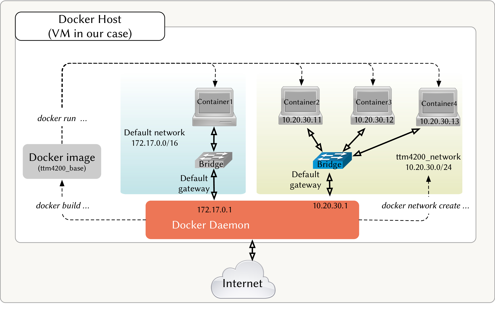
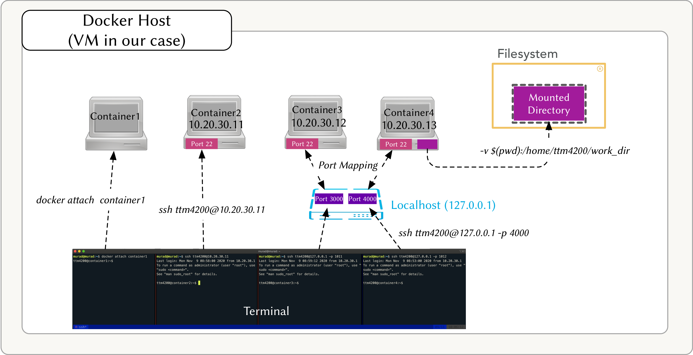
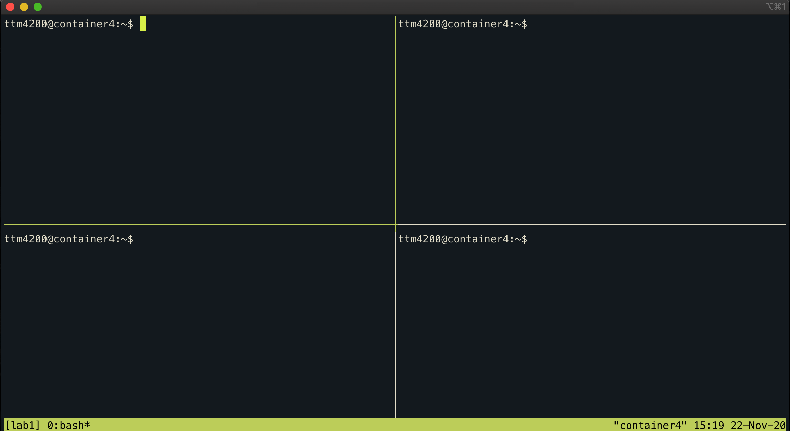
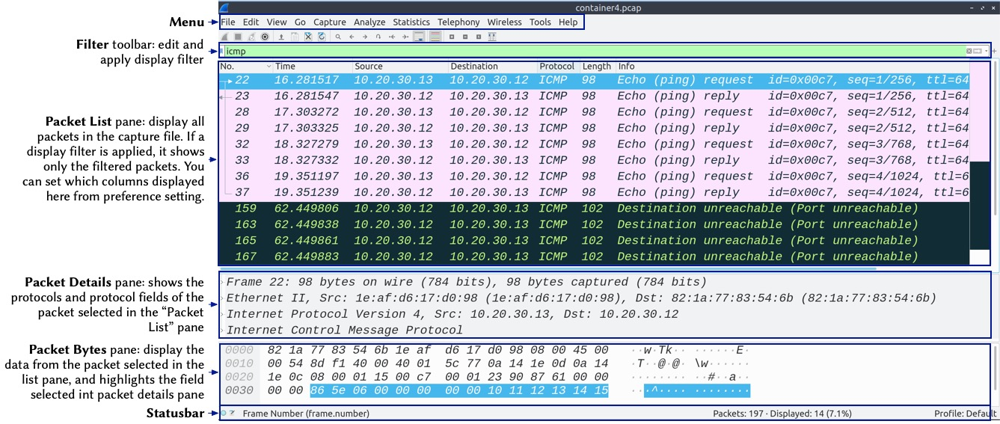

## Lab 1 -- Basic Tools: Docker, Docker Compose, Tcpdump, Wireshark, and Tmux

## Introduction

The goal of this lab is to experiment with the tools you are going to use in this course, including `docker`, `docker-compose`, `tcpdump`, Wireshark, and `tmux`. 

The lab has several **milestones**. 
Make sure you complete each one before advancing to the next. 
The lab has also several **optional** tasks. 
Those are not mandatory, but are intended for those who want to learn more.

There are subsections in each milestone, followed by a unit test. 
Run these tests to ensure that you finished the tasks in that subsection.


# Milestone 1 -- Getting Started with Docker

In this lab, you should get acquainted with [Docker](https://docs.docker.com/) (<https://docs.docker.com/>), since we will use it extensively in all future labs.
Read this [overview](https://docs.docker.com/engine/docker-overview/) (<https://docs.docker.com/engine/docker-overview/>) to get an idea of what Docker is.

By the end of this milestone, you will build a system, as shown in [figure 1](#figure_1) and [figure 2](#figure_2). 
Refer back to these figures as often as needed to understand how the lab is constructed.


<a id='figure_1'></a>

||
|:--:| 
| *Figure 1: Docker Image, Containers, and Networks* |


<a id='figure_2'></a>
||
|:--:| 
| *Figure 2: Docker Attach, SSH,  Port Mapping, and Volumes* |

## 1.1 [Creating Docker Images](https://docs.docker.com/engine/reference/commandline/images/)

To build a docker image, we need to write a [Dockerfile](https://docs.docker.com/engine/reference/builder/) (<https://docs.docker.com/engine/reference/builder/>) that contains all the commands for assembling an image. In this course, **all Dockerfiles will be provided to you**. 
We will always build our images on top of [Ubuntu](https://hub.docker.com/_/ubuntu/).
   >_All the provided commands in this lab assume that your present working directly (`pwd`) is "/home/ttm4200/labs/01-lab1", and they won't work if you are inside another directory._

* Build an image from the Dockerfile in the directory named "ttm4200_base" (it will take some time):

```bash
docker build --tag ttm4200_base ./ttm4200_base/
```

* Check how many images are built locally:

```bash
docker images
```


```python
from test_lab1 import TestLab1
check_progress = TestLab1()
check_progress.test_1_1()
```

## 1.2 [Running Containers](https://docs.docker.com/engine/reference/run/)

* Run a container and name it "container1" from the image you have just built. 
Run the container interactively and in the background (detached mode):

  <div style="background: #f0f3f3; overflow:auto;width:auto;border:solid gray;border-width:.1em .1em .1em .8em;padding:.2em .6em;"><pre style="margin: 0; line-height: 125%">docker run --interactive --tty --detach --name=container1 --hostname=container1 ttm4200_base
  </pre></div><br>

* Check the list of containers in your VM:

  `docker ps --all`

* Attach a terminal to the container. 
This will allow you to control the container interactively in your terminal.

  `docker attach container1`

  <div class="alert alert-block alert-info">
  <b>Tip:</b> The password for the root user inside the container is set to "ttm4200".</div>


* Check the container IP address, MAC address, routing table, and ARP table.

  <div style="background: #f0f3f3; overflow:auto;width:auto;border:solid gray;border-width:.1em .1em .1em .8em;padding:.2em .6em;"><pre style="margin: 0; line-height: 125%">ip address
  ip link
  ip route
  ip neighbor
  </pre></div><br>


  <div class="alert alert-block alert-info">
  <b>Tip:</b> By default, Docker uses the 172.17.0.0/16 subnet for container networking and assigns the first address (172.17.0.1) to the host (the machine which is running Docker daemon, the VM in your case).</div>

* Answer the following questions in the next cell:
    * What is the IP address of the "eth0" interface in 'container1'?
    * What is the MAC address "eth0" interface in 'container1'?
    * What is the default gateway in 'container1'?


```python
# What is the IP address of the "eth0" interface in 'container1'?
eth0_ip_address =  #your answer (in a string)

# What is the MAC address "eth0" interface in 'container1'?
eth0_mac_address =  #your answer (in a string)

# What is the default gateway in 'container1'?
default_gateway =  #your answer (in a string)


check_progress.test_1_2(eth0_ip_address, eth0_mac_address, default_gateway)
```

* Check the container's ARP table with the command `ip neighbor`

* Ping the Docker host, then check again the ARP table.
Do you see any difference?

* Detach from the container (press `Ctrl+p ` followed by `Ctrl+q`).
This will turn the container from interactive mode into daemon mode.

  >_If you press `Ctrl+d` or type `exit`, you will kill the container. This is one of the common pitfalls (especially in later labs)._

>_**Note**: You need to run all the containers from your Virtual Machine (ntnu_server)._

## 1.3 [Docker Network](https://docs.docker.com/network/)


* Create a new docker network with a specific name and subnet:

  <div style="background: #f0f3f3; overflow:auto;width:auto;border:solid gray;border-width:.1em .1em .1em .8em;padding:.2em .6em;"><pre style="margin: 0; line-height: 125%">docker network create --subnet=10.20.30.0/24 ttm4200_net
  </pre></div><br>

* Run a second container (name it "container2") and connect it to the new network, and assign it a static IP address:

  <div style="background: #f0f3f3; overflow:auto;width:auto;border:solid gray;border-width:.1em .1em .1em .8em;padding:.2em .6em;"><pre style="margin: 0; line-height: 125%">docker run -itd --name=container2 --hostname=container2 --net=ttm4200_net --ip=10.20.30.11 ttm4200_base
  </pre></div><br>

* Check the list of docker networks in  your VM:

    ```bash
    docker network ls
    ```


```python
check_progress.test_1_3()
```

## 1.4 [SSH](https://www.baeldung.com/cs/ssh-intro)

* Connect to the "container2" via SSH. The ssh server is already installed and configured in the Dockerfile. 
It is configured to accept only a public key authentication to the user "ttm4200", and the private key is already in the VM ("/home/ttm4200/.ssh/ttm4200_vm_key"). You can connect directly using the container ip address:

  <div style="background: #f0f3f3; overflow:auto;width:auto;border:solid gray;border-width:.1em .1em .1em .8em;padding:.2em .6em;"><pre style="margin: 0; line-height: 125%">ssh -i ~/.ssh/ttm4200_vm_key ttm4200@10.20.30.11
  </pre></div><br>

* To avoid typing the username and the keyname every time you connect to the containers, you can add the following lines to the `~/.ssh/config` file in your server (Virtual Machine) (create it, if it is not already there):

  <div style="background: #f0f3f3; overflow:auto;width:auto;border:solid gray;border-width:.1em .1em .1em .8em;padding:.2em .6em;"><pre style="margin: 0; line-height: 125%">Host 10.* 127.*
      User ttm4200
      IdentityFile ~/.ssh/ttm4200_vm_key
  </pre></div><br>
  
>_This will allow you to connect to the containers with `ssh <ip_address>`._


```python
check_progress.test_1_4()
```

>_To exit the container that you connected to via SSH, press `Ctrl+c` or `exit`._

## 1.5 [Publishing Container's Ports](https://docs.docker.com/config/containers/container-networking/)

By default, a container does not make its port available to the outside world (or the Docker host).
To do so, you have to map a container's port to a port on the Docker Host.

* Run a third container ("container3") and bind its SSH port to an unused port in your Docker Host (preferably a number above 1024, to avoid conflicts), and make it listen on localhost only (127.0.0.1).

  <div style="background: #f0f3f3; overflow:auto;width:auto;border:solid gray;border-width:.1em .1em .1em .8em;padding:.2em .6em;"><pre style="margin: 0; line-height: 125%">docker run -itd --name=container3 --hostname=container3 --net=ttm4200_net --ip=10.20.30.12 -p 127.0.0.1:3000:22 ttm4200_base
  </pre></div><br>

    >_If you don't specify 127.0.0.1 in the port mapping, it will publish the port on all interfaces of the Docker Host (0.0.0.0). 
    This is less ideal from a security perspective._


* Check the list of containers in your VM, and notice the mapped ports in "container3" ([read more on this link](https://stackoverflow.com/questions/41798284/understanding-docker-port-mappings#answer-41798376)):

    ```bash
    docker ps --all
    ```


* Connect to the container using SSH, but using the published port on the localhost of Docker Host:

    ```bash
    ssh ttm4200@127.0.0.1 -p 3000
    ```


```python
# Remain connected to container3 via SSH before checking your progress
check_progress.test_1_5()
```

## 1.6 [Docker Volumes](https://docs.docker.com/storage/volumes/)

To preserve data generated by a container, you can copy them to your host machine or use *Volumes* for persisting data. 
A Docker volume is a mechanism to mount a file system (directory) between a Docker host and a container. 
Thus, any data generated will be stored automatically in your host machine.

* Run a fourth container ("container4") and mount the "ttm4200_base" directory to a directory in the container:
    
    ```bash
    docker run -itd --name=container4 --hostname=container4 --net=ttm4200_net --ip=10.20.30.13 -p 127.0.0.1:4000:22 -v $(pwd)/ttm4200_base:/home/ttm4200/work_dir ttm4200_base
    ```

* Connect to the container (e.g., using SSH) and create an empty file named 'task1_6.txt' in the path '/home/ttm4200/work_dir'.

  <div style="background: #f0f3f3; overflow:auto;width:auto;border:solid gray;border-width:.1em .1em .1em .8em;padding:.2em .6em;"><pre style="margin: 0; line-height: 125%"><span style="color: #0099FF; font-style: italic"># inside the container</span>
  touch ~/work_dir/task1_6.txt
  </pre></div>


```python
check_progress.test_1_6()
```

## 1.7 Cleanup

* Stop and remove all the containers as well as the network.

    ```bash
    docker stop $(docker ps -aq)
    
    docker rm $(docker ps -aq)
    
    docker network prune
    ```


```python
check_progress.test_1_7()
```

# Milestone 2 -- Docker Compose

In this course, we are going to use Docker extensively to build several different services using containers. 
For handling multiple containers at once, we need to use Docker Compose. 
In Docker Compose, we will create a YAML file to configure the application's services, and with a single command, we can create all the images and run the containers at once. Additionally, we will be able to stop and remove all containers and the network in a single command. 
For further reference, see the documentation from [docker-compose.yml](https://docs.docker.com/compose/compose-file/compose-file-v2/) (<https://docs.docker.com/compose/compose-file/compose-file-v2/>).

## 2.1 Creating Docker Compose Files

* Complete the 'docker-compose.yml' file that defines exactly all we did in Milestone 1 (see Figure 1 and Figure 2), specifically:

    * Build an image, called "ttm4200_base", from the Dockerfile in the "ttm4200_base" directory
    * Create a network, called "ttm4200_net", with the subnet "10.20.30.0/24".
    * Run "container1" interactively, with a hostname of "container1", and connect it to the default network.
    * Run "container2" interactively, with a hostname of "container2", and connected to "ttm4200_net". 
    Assign the IPv4 address based on Figure 1 or 2.
    * Run "container3" interactively, with a hostname of "container3", connected to "ttm4200_net", and its SSH port mapped to a port in Docker Host.
    Assign the IPv4 address based on Figure 1 or 2.
    * Run "container4" interactively, with a hostname of "container4", connected to "ttm4200_net", its SSH port mapped to a port in Docker Host, and the "ttm4200_base" directory is mounted to "/home/ttm4200/work_dir" inside the container.
    * Additionally, assign IPv6 addresses to containers connected to "ttm4200_net" within the subnet of "fd00::/64". For instance, you can assign "fd00:11" to container 2. 
    * To make things easier, the network, building the image, "container1" and "container4" are already configured. You must complete "container2" and "container3"!
    
<div class="alert alert-block alert-info">
<b>Tip:</b> The relevant areas are marked as TODO. Also, <b>DO NOT</b> use 'tabs', only spaces are allowed.</div>


```python
%%writefile docker-compose.yml 
# The above command writes the code of this notebook cell into the file 

version: '2.3'
#specify a custom network
networks:
#the name of the created network
    ttm4200_net:
        enable_ipv6: true
        ipam:
            config:
                - subnet: 10.20.30.0/24
                - subnet: "fd00::/64"

services:

    #Building the base image
    image:
        #Build an image from the Dockerfile in the "ttm4200_base" directory
        build: ./ttm4200_base
        #Name the image "ttm4200_base", and use it
        image: ttm4200_base


    container1:
        #use the image "ttm4200_base"
        image: ttm4200_base
        #It will depends the service "image", that built the image
        depends_on:
            - "image"
        #Name of the container "container1"
        container_name: container1
        #Name the host machine "container1"
        hostname: container1
        #Run in "--interactive" mode
        stdin_open: true
        #Run in "--tty", pseudo terminal
        tty: true
        # Add networking capabilities, instead of privileged
        cap_add:
            - NET_ADMIN

    container2:
    ################################################
    # TODO: Your code here!


    ################################################

    container3:
    ################################################
    # TODO: Your code here!


    ################################################

    container4:
        image: ttm4200_base
        depends_on:
            - "image"
        container_name: container4
        hostname: container4
        stdin_open: true
        tty: true
        cap_add:
            - NET_ADMIN
        #map ssh port to a port on Docker Host (port 4000)
        ports:
            - "127.0.0.1:4000:22"
        # mount the "ttm4200_base" directory on Docker Host to the container
        volumes:
            - ./ttm4200_base/:/home/ttm4200/work_dir
        #Connect to the network (ttm4200_net and assign IPv4 and IPv6 addresses)
        networks:
            ttm4200_net:
                ipv4_address: 10.20.30.13
                ipv6_address: "fd00::13"

```


```python
check_progress.test_2_1()
```

## 2.2 Running Docker Compose Files

* Create and start the containers using the docker-compose file:
    ```bash
    docker-compose up -d --build
    ```
    
    
    The "-d" option is to run containers in the background (detached mode), and "\-\-build" is to build the images before starting containers.

* Connect to the containers, as shown in figure 2.
    ```bash
    docker attach container1
    ssh ttm4200@10.20.30.11
    ssh ttm4200@127.0.0.1 -p 3000
    ssh ttm4200@127.0.0.1 -p 4000
    ```


```python
check_progress.test_2_2()
```

# Milestone 3 -- Network Traffic Capture


## 3.1 Terminal multiplexer (`tmux`)

We will use [tmux](http://man.openbsd.org/OpenBSD-current/man1/tmux.1) (<http://man.openbsd.org/OpenBSD-current/man1/tmux.1>) to access multiple terminal sessions simultaneously in a single window.
It lets you switch easily between several programs in one terminal. Additionally, you can detach and re-attach from sessions, thus allowing you to run sessions in the background. This is really helpful if you are working on a remote server. 
[Here](https://shortcutworld.com/tmux/linux/tmux_Shortcuts) (<https://shortcutworld.com/tmux/linux/tmux_Shortcuts>) are the most common `tmux` shortcuts.

* In "container4", start a new `tmux` session (preferably a named session to distinguish between multiple sessions):

    ```bash
    tmux new -s [session_name]
    ```

* Create four panes as shown in Figure 6.

    >_To execute a command in `tmux`, a prefix must be used before the command (`<prefix> + command`). By default, the prefix is `Ctrl+b`. 
    For example, to create a vertical split use `<prefix> + %`. 
    That is, you have to press the keys `Ctrl+b` followed by the command `%` (without the control key). To create a horizontal split use `<prefix> + "`. 
    To move between panes use `<prefix> + Arrow Keys`.
    To remove a pane use `<prefix> + x` and then `y+Enter`._ 

<!--  -->


||
|:--:| 
| *Figure 3: Tmux example* |

* Detatch from the current session by using `<prefix> + d`.

* **_Optional:_** If you feel that `tmux` key combinations are awkward, you can customize it according to your personal preferences. 
For example, to change the prefix from `Ctrl+b` to `Ctrl+a`, simply add the following lines to `tmux` configuration file (".tmux.conf") inside the user's home directory ("/home/ttm4200"):

    ```bash
    unbind C-b
    set-option -g prefix C-a
    bind-key C-a send-prefix
    ```

    And to change the command for vertical split from `%` to  `\`, horizontal split from `"` to `-`, add the following lines:

    ```bash
    bind-key \ split-window -h
    bind-key - split-window -v
    ```

    And you can do many interesting customizations such as fast pane-switching, pane-resizing, etc. 
    If you are interested see this [blog](https://www.hamvocke.com/blog/a-guide-to-customizing-your-tmux-conf/) (<https://www.hamvocke.com/blog/a-guide-to-customizing-your-tmux-conf/>). 
    For these changes to take effect, you have to exit from `tmux`, i.e., kill all active sessions.
    In this course, to change the `tmux` configuration for all containers, you only need to change ".tmux.conf" inside the folder from which the image is built ("ttm4200_base", in this case). 
    But you have to rebuild the image and containers for these configurations to take effect.

## 3.2 Traffic Capture

To capture network traffic, we will use [tcpdump](https://www.tcpdump.org/manpages/tcpdump.1.html) (<https://www.tcpdump.org/manpages/tcpdump.1.html>), which is a command-line packet capturing utility that allows us to sniff, capture and monitor any type of traffic on a network easily.

* Connect to "container4" using SSH, then attach to the previously created session:
    ```bash
    tmux attach -t [session_name]
    ```
    
    
* In one pane, start packet capturing with tcpdump and dump the captured packets to a file:
    ```bash
    sudo tcpdump -i eth0  -w work_dir/container4.pcap
    ```


* Switch to the other pane `Ctrl+b arrow key`, ping and traceroute "container3" using IPv4 and IPv6 addresses.
    ```bash
    ping 10.20.30.12
    ping -6 fd00::12
    traceroute 10.20.30.12
    ```
    > _Note: Make sure you don't copy the entire block of commands into the terminal, rather copy each one individually._

    > _We highly recommend getting comfortable using tmux, as it will be worth the time you spent learning it. 
    Otherwise, you can just open multiple SSH connections._

* Stop the tcpdump capturing and copy the capture file to your host machine. 
You can use [scp](https://haydenjames.io/linux-securely-copy-files-using-scp/) (<https://haydenjames.io/linux-securely-copy-files-using-scp/>), for example, use this command in your **VM**:
    ```bash
    scp -P 4000 ttm4200@127.0.0.1:~/work_dir/container4.pcap ./
    ```

    > _Since the "ttm4200\_base" directory is mounted on "container4" in 'work\_dir', any file saved to the "work\_dir" inside the container, will be directly saved to the "ttm4200\_base" folder. 
    However, pay attention to the file permission._

* Using the docker-compose file, stop and remove the containers, as well as the network. 
You can do so with only one command:

    ```bash
    docker-compose down
    ```


```python
check_progress.test_3_2()
```

# Milestone 4: Analyzing Packet Captures

The goal of this milestone is to learn how to analyze network traffic and extract relevant information. 
You will use [Wireshark](https://www.wireshark.org/docs/wsug_html_chunked/index.html), which is a free and open-source packet analyzer. 
You can refer to the course's book in "Chapter 1: Wireshark Lab" (also Wireshark Lab: Getting Started).

* Open the file "container4.pcap" using Wireshark: `wireshark container4.pcap`.

>_Since Wireshark is a graphical application, you can not open it in the remote VM._ 
>
>_Copy the file "container4.pcap" to your local computer and open it using Wireshark.
> From the local computer copy the file using the command `scp ntnu_server:</path/to/container4.pcap> </path/to/local/file>`._


||
|:--:| 
| *Figure 4: Wireshark main Window* |

 
* In the  "Filter" toolbar, apply the `ssh` display filter to show only SSH packets.

* From "Packet List" pane, select one packet. 
Then inspect its details in the "Packet Details" pane. 
Notice the protocol layering and encapsulation. 


## 4.1 Application-layer message

* In the "Packet Details" pane, expand the "SSH Protocol" field. 
Notice that you cannot read the content of the message (encrypted packet). 
This message is passed to the transport layer.
    * What is the packet number (packet ordinals in the capture file) of the selected packet?


```python
# What is the packet number (packet ordinals in the capture file) of the selected packet?
packet_number =  #your answer (as an integer)

check_progress.test_4_1(packet_number)
```

## 4.2 Transport-layer segment

* The transport layer segment encapsulates the application-layer message by appending "transport-layer header information" such as port numbers and checksum. 
In the "Packet Details" pane, expand the "Transmission Control Protocol" field, then answer the following questions about some of the added information. 
You can copy the answer directly from Wireshark (right-click on a field $\rightarrow$ copy $\rightarrow$ value).
    * What is the source port of the selected packet?
    * What is the destination port?
    * What is the value of the checksum (error-detection bits)?


```python
# What is the source port of the selected packet?
source_port =  #your answer (as an integer)

# What is the destination port?
destination_port =  #your answer (as an integer)

# What is the value of the checksum (error-detection bits)?
checksum =  #your answer (either in hexadecimal or decimal)

check_progress.test_4_2(packet_number, source_port, destination_port, checksum) 
```

## 4.3 Network-layer datagram

* The network-layer datagram encapsulates the transport-layer segment by appending "network-layer header information", such as source and destination IP addresses. 
In the "Packet Details" pane, expand the "Internet Protocol" field, then answer the following questions:
    * What is the source IP address of the selected packet?
    * What is the destination IP address?
    * What is the datagram length?


```python
# What is the source IP address of the selected packet?
source_ip =   #your answer (as a string)

# What is the destination IP address?
destination_ip =  #your answer (as a string)

# What is the datagram length?
datagram_length =  #your answer (as an integer of bytes)

check_progress.test_4_3(packet_number, source_ip, destination_ip, datagram_length)
```

## 4.4 Link-layer frame

* The link-layer frame encapsulates the network-layer datagram by appending  "link-layer header information". 
In the "Packet Details" pane, expand the "Ethernet II" and "Frame" fields, then answer the following questions:
    * What is the source MAC address of the selected packet?
    * What is the destination MAC address?
    * What is the frame length?


```python
# What is the source MAC address of the selectedd packet?
source_mac =  #your answer (as a string)

# What is the destination MAC address?
destination_mac =  #your answer (as a string)

# What is the frame length?
frame_length =  #your answer (as an integer of bytes)


check_progress.test_4_4(packet_number, source_mac, destination_mac, frame_length)
```

## Optional: SSH/SCP proxyjump

Throughout the course, we will use Wireshark extensively. 
Most of the capture files are done in the containers, and you may want to open them in your local machine. 
However, you need to first copy the file from the container to the VM, then from the VM to your local machine. 
This is a bit cumbersome, and you can make it easier by using proxyjump.

```bash
scp -J ntnu_server ttm4200@container_ip:~/work_dir/pcap_file ./pcap_file
```

But you need to add "ttm4200_vm_key" to the local machine:

```bash
scp ntun_server:~/.ssh/ttm4200_vm_key ~/.ssh/ttm4200_vm_key
```

Then, add the following to `~/.ssh/config`

```bash
Host 10.*
    User ttm4200
    IdentityFile ~/.ssh/ttm4200_vm_key
```
