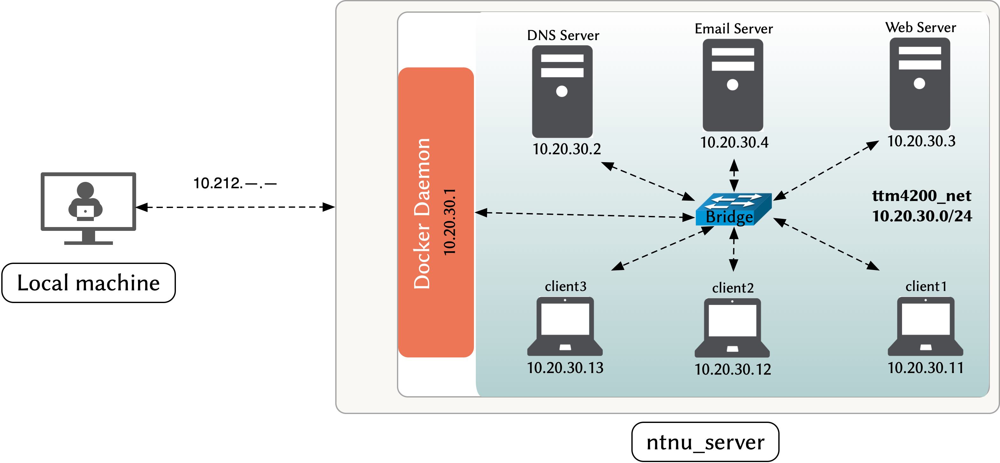

# Lab2 -- Application Layer: Web, Email, and DNS

## Introduction

The  goal of this lab is to introduce you to three foundational network applications: web, email, and DNS. 
For each application, you will learn how to setup your own server, how to use a client to interact with the server, and how to analyze the network traffic generated by the application. 

### lab setup

[Figure 1](#figure_1) shows the topology of the lab. 

<a id='figure_1'></a>

||
|:--:| 
| *Figure 1: Lab2 System Setup* |


- The topology in [Figure 1](#figure_1) is defined in the "docker-compose.yml" file. 
You can use the following command in your "ntnu_server" to start the lab environment.

```bash
docker-compose up -d --build
```


>_Note: The first time you run the command, it will take a while (about 3 - 5 minutes) to build the docker images. 
Use that time to read the "docker-compose.yml" file and understand the topology. 
You will also use this topology in the next lab. 
Thus, it is important to understand the topology and the docker-compose file._

- You can connect to any container using `ssh <container_IP>`. 

- To copy files between the "ntnu_server" and the containers, you can use the `scp` command. 
Alternatively, you can use the mounted volume to copy files between the containers. 
Refer to the "docker-compose.yml" file to find the mounted volume path.

- The password for the root user in all the containers is "ttm4200".

- To save your configuration in a container, you can use the script "save.sh":

```bash
sudo sh ~/work_dir/save.sh
```


```python
from test_lab2 import TestLab2
check_progress = TestLab2()
```

# Milestone 1 -- Web Server

In this milestone, you will setup a web server using Nginx. 
[Nginx](https://www.nginx.com/) is a lightweight, open source web server that is widely used in production environments. 
In addition to serving web content, Nginx can also be used as a reverse proxy (a server that forwards requests to another server), a load balancer (a server that distributes requests to multiple servers), and an HTTP cache (a server that caches web content). 
In this milestone, you will use Nginx to serve web content for your own website. 
In the next milestone, you will use Nginx as a reverse proxy to forward requests to the email server (i.e., the web server will act as a front-end for the email server) to serve webmail content.


## Background

This section provides a brief introduction to Nginx, but you are encouraged to read the [Nginx documentation](https://nginx.org/en/docs/) to learn more about Nginx. 
In particular, you should read the [Beginner's Guide](https://nginx.org/en/docs/beginners_guide.html).

### Nginx workflow

Nginx works as follows:

- Nginx listens on a specific port for incoming HTTP requests.

- When a request is received, Nginx looks for a configuration file that matches the request. 

- If a configuration file is found, Nginx will use the configuration file to process the request. 
The configuration file can specify the location of the web content. 
After processing the request, Nginx will return the response to the client.


### Nginx configuration

#### Configuration file structure

Nginx configuration files are located in the "/etc/nginx/" directory and are organized in the following way:

- The main configuration file is located in "/etc/nginx/nginx.conf". 
This file contains the global directives that define the behavior of the server.

- The configuration files for each site are located in the "/etc/nginx/sites-available" directory. 
These files contain the directives that define the behavior of the server when handling HTTP requests for a specific domain.

- A symbolic link to the configuration file for each site is located in the "/etc/nginx/sites-enabled" directory. 
These symbolic links are used to enable or disable the sites.


#### Configuration syntax

You can customize the behavior of Nginx by defining directives in the configuration files. 
Directives are divided into two categories: 

- Simple directive: consists of the name and parameters of the directive. 
For example, the `listen 80;` directive tells Nginx to listen on port 80 for incoming HTTP requests.

- Block directive: consists of the name of the directive followed by braces that contain other directives. 
The two important block directives are `server { ... }` and `location { ... }`. 
    - The `server { ... }` directive contains multiple directives that define the behavior of the server when handling HTTP requests for a specific domain. 
    - The `location { ... }` directive tells Nginx where to find the web content for a specific location.

## Tasks

### Task 1.1 -- Setup your own website

In this task, you will use Nginx to serve your own website. 
Nginx is already installed in the "webserver" container. 
Follow the steps below to setup your own website:

- Connect to the "webserver" container using `ssh`.

- Create a directory named "teamsite" in the "/var/www/" directory. 
This directory will contain the web content for your website.

- Create a file named "index.html" in the "teamsite" directory. 
This file will be the home page of your website. Edit the file to include information about your team. For example:

```html 
<!DOCTYPE html>
<html>
<head>
    <title>Team YOUR_TEAM_NUMBER</title>
</head>
<body>
    <h1>Team YOUR_TEAM_NUMBER</h1>
        <p>Team members: YOUR_TEAM_MEMBERS</p>
</body>
</html>
```


- Create a configuration file named "teamsite.conf" in the "/etc/nginx/sites-available" directory. 
This file will contain the directives that define the behavior of Nginx when handling HTTP requests for your website. 
Edit the file to include the following directives:

```nginx
server {
    # specify the port that Nginx will listen on and make it the default server (i.e., Nginx will use this configuration file to handle all requests that are not handled by other configuration files)
    listen 80 default_server;

    # specify the domain name of your website
    server_name www.team<YOUR_TEAM_NUMBER>.com;

    # specify the location of the web content for your website
    root ===YOUR_WEBSITE_DIRECTORY===;

    # specify the home page of your website
    index ===YOUR_HOME_PAGE===;
}
```


- Create a symbolic link to the "teamsite.conf" file in the "/etc/nginx/sites-enabled" directory. 
This symbolic link will enable your website.

```bash
sudo ln -s /etc/nginx/sites-available/teamsite.conf /etc/nginx/sites-enabled/
```


- Check the syntax of the configuration file: `sudo nginx -t`.

- Restart Nginx to apply the changes: `sudo service nginx restart`.

- Verify that your website is working correctly. On the "**ntnu_server**", run the following command:

```bash
wget -O - http://10.20.30.1
```


>_Note:  In this milestone, we are using the IP address of the "webserver" container instead of the domain name to access the website. 
This is because the DNS server is not configured yet. 
Your machine will not be able to resolve the domain name of your website to the IP address of the "webserver" container. 
In the third milestone, you will configure the DNS server to resolve the domain name of your website to the IP address of the "webserver" container._


- On your **local** machine, open a web browser and navigate to your website: `http://<your_ntnu_server_IP>`. You should see the home page of your website.

>_Note: Use the IP address of your "ntnu\_server" not the "webserver" container. This works because the "docker-compose.yml" file maps the port 80 of the "webserver" container to the port 80 of the "ntnu\_server"._


```python
check_progress.test_1_1()
```

### Task 1.2 -- Capturing HTTP traffic

In this task, you will capture an HTTP traffic between a client and your website. Follow the steps below to capture the HTTP traffic:

- Connect to the "client1" container and start two `tmux` panes.

- In the first pane, start packet capture using `tcpdump` and save the output to a file named "client1_http.pcap". 

- In the second pane, retrieve the home page of your website using the following commands:

```bash
wget http://10.20.30.3 --no-http-keep-alive 

wget http://10.20.30.3 
```


- Stop the packet capture and copy the "client1_http.pcap" file to your **ntnu_server**, using `scp`. Place the file in the "02-lab2" directory.


```python
check_progress.test_1_2()
```

### Task 1.3 -- Analyzing HTTP traffic

In this task, you will analyze the HTTP traffic that you captured in the previous task. 
Follow the steps below to analyze the HTTP traffic:

- Open the "client1_http.pcap" file in Wireshark.

>_Note: You can copy the "client1\_http.pcap" file to your **local** machine and open it in Wireshark._

- Filter the packets to display only the HTTP packets. You can do this by typing "http" in the "Display Filter" box.

- Select one of the HTTP GET requests and examine the details of the request and its corresponding response. 
You can do this by right-clicking on the packet and selecting "Follow" -> "HTTP Stream". Then, answer the following questions:
    - What is the packer number (i.e., packet ordinals in the capture file) of the HTTP GET request? What is the packet number of the corresponding HTTP response?
    - What is the HTTP version used by the client and the server?
    - Is the connection persistent or non-persistent?
    - How many bytes (i.e., content length) are transferred in the response?
    - When was the HTML file of the home page last modified?


```python
#- What is the packer number (i.e., packet ordinals in the capture file) of the HTTP GET request? What is the packet number of the corresponding HTTP response?
HTTP_GET_packet_number =  #your answer (as an interger)
HTTP_response_packet_number = #your answer (as an interger)

#- What is the HTTP version used by the client and the server?
client_HTTP_version =  #your answer (as a float)
server_HTTP_version =  #your answer (as a float)

#- Is the connection persistent or non-persistent?
connection_type =  #your answer (as a string of either 'persistent', or 'non-persistent')

#- How many bytes (i.e., content length) are transferred in the response?
content_length= #your answer (as an interger)

#- When was the HTML file of the home page last modified?
last_modified =  ##your answer (as a string of "hours:minutes:seconds")

check_progress.test_1_3(HTTP_GET_packet_number,
                        HTTP_response_packet_number,
                        client_HTTP_version,
                        server_HTTP_version,
                        connection_type,
                        content_length, last_modified)
```

>_Note: For determining whether the connection is persistent or non-persistent, please refer to pages 128-131 in the textbook._

# Milestone 2 -- Email Server

In this milestone, you will setup an email server.  
You will create a virtual domain for your team and a mailbox for each team member. 
Then, you will analyze the email traffic of sending and receiving email messages.


## Background

An email server consists of several software components that provide a specific function. 
Here is a brief description of the main components of an email server and the software solutions that you will use in this lab:


- **Mail Transfer Agent (MTA)**: 
The MTA handles SMTP (Simple Mail Transfer Protocol) traffic. 
It is responsible for sending email messages to the recipients or to different email servers. 
It also receives email messages from the senders or from different email servers. 
In this lab, you will use the [Postfix](https://www.postfix.org/documentation.html), an open-source MTA. 
Postfix is already installed and configured on the "mailserver" container.

- **Mail Delivery Agent (MDA)**: 
The MDA is responsible for retrieving the email messages from an MTA and storing them in the mailboxes of the recipients. 
IMAP (Internet Message Access Protocol) or POP3 (Post Office Protocol 3) are such protocols  used by the MDA to retrieve email messages from the MTA. 
In this lab, you will use the [Dovecot](https://doc.dovecot.org/), an open-source MDA. 
Dovecot is already installed and configured on the "mailserver" container.

- **Mail Client**: 
The mail client is a software application that is used by the users to read and send email messages. 
In this lab, you will use the [Thunderbird](https://www.thunderbird.net/en-US/), an open-source mail client. 
Thunderbird is already installed on the "Sahara" PCs. 

- **Webmail**: 
Webmail is a web-based email client that is used by the users to read and send email messages through HTTP. 
In this lab, you will use the [Roundcube](https://roundcube.net/), an open-source webmail. 
Roundcube is already installed and configured on the "mailserver" container.       


- **Database**: 
The database is used to store the information about the users, the mailboxes, and the email messages. 
In this lab, you will use the [MySQL](https://dev.mysql.com/doc/), an open-source database. 
MySQL is already installed and configured on the "mailserver" container.

- **Web Server**: 
The web server is used to host the webmail and the web-based administration interface. 
One such web-based administration interface is [Postfixadmin](https://github.com/postfixadmin/postfixadmin), which you will use to manage the mailboxes and the virtual domains. 
Another such web-based administration interface is [phpMyAdmin](https://www.phpmyadmin.net/), which you will use to manage the MySQL database. Nginx is already setup in the "mailserver" container, but you will need to setup a reverse proxy in the "webserver" container to forward the requests to the "mailserver" container. 


## Tasks


### Task 2.1 -- Reverse proxy 

In milestone 1, you have created a web server in the "webserver" container. 
In this task, you will also create a reverse proxy to forward  webmail, postfixadmin, and phpmyadmin requests to the "mailserver" container. 


- Connect to your **"webserver"** container and edit your configuration file  "/etc/nginx/sites-available/teamsite.conf" to include the following lines inside the "server" block:

```nginx
location /webmail/ {
    proxy_pass http://10.20.30.4:80;
}

location /postfixadmin/ {
    proxy_pass http://10.20.30.4:80;
}

location /phpmyadmin/ {
    proxy_pass http://10.20.30.4:80;
}
```


>_The `location` directive tells NGINX where to look for a resource that matches against the URL requested by the client. 
In this case, the location directive matches the URL that ends with "/postfixadmin/", "/webmail/", and "/phpmyadmin/". 
The `proxy_pass` directive allows to forward a request to another server. 
In this case, the request is forwarded to the "mailserver" container._

- Restart Nginx to apply the changes `sudo service nginx restart`.

- Verify that you can access webmail, postfixadmin, and phpmyadmin using the following URLs in your browser:
    - webmail: `http://<your_ntnu_server_IP>/webmail/`
    - postfixadmin: `http://<your_ntnu_server_IP>/postfixadmin/`
    - phpmyadmin: `http://<your_ntnu_server_IP>/phpmyadmin/`


```python
check_progress.test_2_1()
```

### Task 2.2 -- Virtual domain and mailboxes

In this task, you will use postfixadmin to create a virtual domain and mailboxes for your team.


- Open the URL `http://<your_ntnu_server_IP>/postfixadmin/setup.php` in your browser.

- Navigate to "Login with setup_password" and enter the setup password "ttm4200" -> "Enter".

- Navigate to "Add superadmin account" and enter the following information:
    - Setup password: "ttm4200"
    - Admin: ===YOUR_NTNU_EMAIL_ADDRESS===
    - Password: ===CHOOSE_A_PASSWORD===
    - Password (confirm): ===CHOOSE_A_PASSWORD===
    - Click "Add Admin".


- Login to your admin account using the URL `http://<your_ntnu_server_IP>/postfixadmin/login.php`. 
The username is "==YOUR_NTNU_EMAIL_ADDRESS==" and the password is your password that you have chosen in the previous step.

- Create a virtual domain for your team. Navigate to "Domain List" -> "New Domain" and enter the following information:
    - Domain: team===YOUR_TEAM_NUMBER===.com
    - Description: ===WRITE_A_DESCRIPTION===
    - LEAVE THE OTHER FIELDS AS DEFAULT
    - Click "Add Domain"

- Create a mailbox for each team member. Navigate to "Virtual List" -> "Add Mailbox" and enter the following information:
    - Username: ===FIRST_NAME===.===LAST_NAME===
    - Domain: team===YOUR_TEAM_NUMBER===.com
    - Password: ===CHOOSE_A_PASSWORD===
    - Password (again): ===CHOOSE_A_PASSWORD===
    - Name: ===FIRST_NAME=== ===LAST_NAME===
    - LEAVE THE OTHER FIELDS AS DEFAULT
    - Click "Add Mailbox"

- Check that the admin, virtual domain, and mailboxes are created by logging in to PhpMyAdmin using the URL `http://<your_ntnu_server_IP>/phpmyadmin/`. 
The username and password are "root" and "ttm4200", respectively. 
Then, select the "postfix" database and check the "admin", "domain", and "mailbox" tables.  
Answer the following questions:
    - What is the username of the admin account (in the "admin" table)?
    - What is the domain name (in the "domain" table)?
    - What are two of the usernames of the mailboxes (in the "mailbox" table)?


```python
# What is the username of the admin account (in the "admin" table)?
admin_username = # YOUR ANSWER HERE (AS A STRING)

# What is the domain name (in the "domain" table)?
domain_name = # YOUR ANSWER HERE (AS A STRING)

# What are two of the usernames of the mailboxes (in the "mailbox" table)?
first_mailbox_username = # YOUR ANSWER HERE (AS A STRING)
second_mailbox_username = # YOUR ANSWER HERE (AS A STRING)

check_progress.test_2_2(admin_username, domain_name, first_mailbox_username, second_mailbox_username)

```

### Task 2.3 -- Capturing email traffic

In this task, you will use tcpdump to capture the email traffic between the "mailserver" and the email client as well as webmail. 

- Open the URL `http://<your_ntnu_server_IP>/webmail/` in your browser and login to webmail using the credentials of one of the mailboxes that you have created in the previous task.

- Connect to your **"mailserver"** container and start capturing the traffic on the "eth0" interface. 
Save the output to a file named "mailserver.pcap": `sudo tcpdump -i eth0 -w mailserver.pcap`.

- On your **local machine**, open Thunderbird. Navigate to "Settings" -> "Account Settings" -> "Account Actions" -> "Add Mail Account" and enter the following information, using the credentials of **another** mailbox that you have created in the previous task:
    - Your full name: ===FIRST_NAME=== ===LAST_NAME===
    - Email Address: ===FIRST_NAME===.===LAST_NAME===@team===YOUR_TEAM_NUMBER===.com
    - Password: ===PASSWORD_OF_THE_MAILBOX===
    - Click "Configure manually"
    - Incoming Server:
        * Protocol: IMAP
        * Hostname: ===YOUR_NTNU_SERVER_IP=== 
        * Port: 143
        * Connection Security: None 
        * Authentication: Normal password
        * Username: ===FIRST_NAME===.===LAST_NAME===@team===YOUR_TEAM_NUMBER===.com
    - Outgoing Server:
        * Hostname: ===YOUR_NTNU_SERVER_IP===
        * Port: 25
        * Connection Security: None
        * Authentication: Normal password
        * Username: ===FIRST_NAME===.===LAST_NAME===@team===YOUR_TEAM_NUMBER===.com
    - Click "Done"
    - Click "I understand the risks" and "Confirm"

- Send an email from Thunderbird to the mailbox that you have used to login to webmail.

- In the webmail, check that you have received the email. 
Then reply to the received email.

- Stop capturing the traffic on the "mailserver" container.

- Copy the file "mailserver.pcap" from the "mailserver" container to your **ntnu_server** using `scp`. 
Place the file in the "02-lab2" directory.


```python
check_progress.test_2_3()
```

### Task 2.4 -- Analyzing email traffic

In this task, you will analyze the captured email traffic using Wireshark.

#### SMTP

- Open the file "mailserver.pcap" in Wireshark on your **local machine**.

- Apply the filter `tcp.port == 25` to show only the SMTP traffic.

- [Follow TCP Steam](https://www.wireshark.org/docs/wsug_html_chunked/ChAdvFollowStreamSection.html) of the SMTP traffic to see the SMTP conversation between the "mailserver" and the email client: "Right click" on the first packet of the SMTP traffic -> "Follow" -> "TCP Stream".

- Examine the SMTP conversation and compare it with the example transcript of messages exchanged between an SMTP client and an SMTP server in the book, page 149-150.

- Answer the following questions:
    - What is the packet number of the SMTP Service Ready message (labelled "220")? 
    - What is packet number of the client TCP acknowledgement of the SMTP Service Ready message (labelled "ACK")?
    - What is the packet number of the SMTP HELO message (labelled "EHLO")? 
    - What is packet number of the server TCP acknowledgement of the SMTP HELO message (labelled "ACK")?
    - What is the packet number of the SMTP MAIL FROM message (labelled "MAIL FROM")? 
    - What is packet number of the server TCP acknowledgement of the SMTP MAIL FROM message (labelled "ACK")?
    - What is the packet number of the SMTP RCPT TO message (labelled "RCPT TO")?
    - What is packet number of the server TCP acknowledgement of the SMTP RCPT TO message (labelled "ACK")?
    - What is the packet number of the SMTP DATA message (labelled "DATA")?
    - What is packet number of the server acknowledgement of the SMTP DATA message (labelled "354")?


```python
# What is the packet number of the SMTP Service Ready message (labelled "220")?
SMTP_service_ready_packet_number = # YOUR ANSWER HERE (AS AN INTEGER)

# What is packet number of the client TCP acknowledgement of the SMTP Service Ready message (labelled "ACK")?
SMTP_service_ready_ack_packet_number = # YOUR ANSWER HERE (AS AN INTEGER)

# What is the packet number of the SMTP HELO message (labelled "EHLO")?
SMTP_helo_packet_number = # YOUR ANSWER HERE (AS AN INTEGER)

# What is packet number of the server TCP acknowledgement of the SMTP HELO message (labelled "ACK")?
SMTP_helo_ack_packet_number = # YOUR ANSWER HERE (AS AN INTEGER)

# What is the packet number of the SMTP MAIL FROM message (labelled "MAIL FROM")?
SMTP_mail_from_packet_number = # YOUR ANSWER HERE (AS AN INTEGER)

# What is packet number of the server TCP acknowledgement of the SMTP MAIL FROM message (labelled "ACK")?
SMTP_mail_from_ack_packet_number = # YOUR ANSWER HERE (AS AN INTEGER)

# What is the packet number of the SMTP RCPT TO message (labelled "RCPT TO")?
SMTP_rcpt_to_packet_number = # YOUR ANSWER HERE (AS AN INTEGER)

# What is packet number of the server TCP acknowledgement of the SMTP RCPT TO message (labelled "ACK")?
SMTP_rcpt_to_ack_packet_number = # YOUR ANSWER HERE (AS AN INTEGER)


# What is the packet number of the SMTP DATA message (labelled "DATA")?
SMTP_data_packet_number = # YOUR ANSWER HERE (AS AN INTEGER)

# What is packet number of the server acknowledgement of the SMTP DATA message (labelled "354")?
SMTP_data_ack_packet_number = # YOUR ANSWER HERE (AS AN INTEGER)


check_progress.test_2_4(SMTP_service_ready_packet_number,
                        SMTP_service_ready_ack_packet_number,
                        SMTP_helo_packet_number,
                        SMTP_helo_ack_packet_number,
                        SMTP_mail_from_packet_number,
                        SMTP_mail_from_ack_packet_number,
                        SMTP_rcpt_to_packet_number,
                        SMTP_rcpt_to_ack_packet_number,
                        SMTP_data_packet_number,
                        SMTP_data_ack_packet_number)
```

>_Additional question: Are there any missing messages compared to the example in the textbook on pages 149-150? Discuss this question together, then call your TA and present your findings._

#### IMAP

- Apply the display filter `imap` to the capture file `mailserver.pcap` to show only the IMAP and IMF traffic. 
Select the packet corresponding to the body of the reply message sent by the email user on webmail. 
Make sure that you see the email message in the "Line-based text data" section of the packet details pane.


- Follow TCP Stream of the packet you selected in the previous step. Then answer the following questions:
    - What is the packet number corresponding to the body of the IMAP retrieval of the reply message ?
    - What is the packet number of the IMAP FETCH command sent by the client, directly before reply message retrieval?
    - What is the packet number corresponding to the client requesting login authentication (Request: authenticate PLAIN)?
    - What is the packet number of the server response of successful login (Response:  OK [CAPABILITY ...] logged in)?


```python
# What is the packet number corresponding to the body of the IMAP retrieval of the reply message ?
IMAP_retrieval_body_packet_number = # YOUR ANSWER HERE (AS AN INTEGER)

#What is the packet number of the IMAP FETCH command sent by the client, directly before reply message retrieval?
IMAP_fetch_packet_number = # YOUR ANSWER HERE (AS AN INTEGER)

# What is the packet number corresponding to the client requesting login authentication (Request: authenticate PLAIN)?  
IMAP_login_request_packet_number = # YOUR ANSWER HERE (AS AN INTEGER)

# What is the packet number of the server response of successful login (Response:  OK [CAPABILITY ...] logged in)?
IMAP_login_response_packet_number = # YOUR ANSWER HERE (AS AN INTEGER)

check_progress.test_2_5(IMAP_retrieval_body_packet_number,
                        IMAP_fetch_packet_number,
                        IMAP_login_request_packet_number,
                        IMAP_login_response_packet_number)
```

#### Webmail

- Apply the display filter `http.request.method == "POST"` to the capture file `mailserver.pcap` to show only the HTTP POST traffic. 
Select the packet corresponding to the reply message sent by the email user on webmail. 
Make sure that you see the email message in the "HTML Form URL Encoded" section of the packet details pane.
    - What is the packet number corresponding to the reply message sent by the email user on webmail?


```python
# What is the packet number corresponding to the reply message sent by the email user on webmail?
webmail_reply_packet_number = # YOUR ANSWER HERE (AS AN INTEGER)

check_progress.test_2_6(webmail_reply_packet_number)
```

# Milestone 3 -- DNS

In this milestone, you will configure your own DNS server and use it to resolve domain names. You will also capture  and analyze DNS traffic.

## Background

In this lab, you will use the software package [BIND9](https://www.isc.org/bind/) to set up your own DNS server. 
BIND9 is a free and open-source implementation of the DNS protocols and it is [widely used](https://en.wikipedia.org/wiki/BIND) especially in Unix-like operating systems. 


### Workflow

A simplified workflow of BIND9 is as follows:

- The DNS server is configured with a set of DNS records that map domain names to IP addresses.

- The DNS server listens for DNS queries from clients on a specific port (usually 53).

- When a client sends a DNS query to the DNS server, the server looks up the domain name in its records and returns the corresponding IP address.

- If the DNS server does not have a record for the domain name, it forwards the query to another DNS server. 


### Configuration files

The configuration files for BIND9 are located in the `/etc/bind` directory. 
These are the main files:

- `named.conf`: The primary configuration file that `includes` other configuration files.

- `named.conf.options`: The configuration file that specifies the options for the DNS server. 
Here you can specify the port number that the DNS server listens on, which netowrks are allowed to query the server, which DNS servers to forward queries to, etc.

- `named.conf.local`: The configuration file that specifies the "zone" files that the DNS server uses. 


### [Zone files](https://bind9.readthedocs.io/en/latest/chapter3.html#base-zone-file)


A zone file contains a list of DNS records that the DNS server uses to resolve domain names. 
There is a zone file for each domain name that the DNS server is responsible for. 
For example, if the DNS server is responsible for the domain name `team30.com`, there will be a zone file called `team30.com.zone` in the `/etc/bind` directory.


#### [Zone file format](https://en.wikipedia.org/wiki/Zone_file)

A zone file contains a list of entries, separated by newlines. 
Each entry can be a directive or a record. An entry consists of several fields, separated by whitespace (tabs or spaces).


The most common directives are:

- `$ORIGIN`: Specifies the domain name that the records in the zone file are relative to. 
For example, if the zone file is `team30.com.zone`, the `$ORIGIN` directive should be `team30.com`.

- `$TTL`: Specifies the default time-to-live (TTL) for the records in the zone file. 
The TTL specifies how long a client should cache the record before querying the DNS server again. 


The format of a [record](https://en.wikipedia.org/wiki/Domain_Name_System#Resource_records) is:

```zone
<domain name> <TTL> <class> <type> <value>
```


- `<domain name>`: This field represents the domain name that the record maps to. 
This can be a fully qualified domain name (FQDN) or a relative domain name. 
A fully qualified domain name ends with a `.` such as `team30.com.`. 
A relative domain name is relative to the domain name specified in the `$ORIGIN` directive. 
For example, if the `$ORIGIN` directive is `team30.com`, then `www` is a relative domain name that represents `www.team30.com`. 
The `<domain name>` field can also be `@` which represents the domain name specified in the `$ORIGIN` directive. 
It can also be left blank, then the domain name is the same as the previous record.

- `<TTL>`: This field represents the time-to-live (TTL) for the record. 
It can be omitted if the default TTL (`$TTL` directive) is used.

- `<class>`: This field represents the class of the record. 
The default class is `IN` which represents the Internet class. 

- `<type>`: This field represents the type of the record.  
The most common [types](https://en.wikipedia.org/wiki/List_of_DNS_record_types) of records are:
    - `A`: A record that maps a domain name to an IPv4 address.
    - `AAAA`: A record that maps a domain name to an IPv6 address.
    - `CNAME`: A record that maps a domain name to another domain name. 
    This is used for aliasing domain names. 
    For example, `www.team30.com` is an alias for `team30.com`.
    - `MX`: A record that maps a domain name to an email server. 
    This is used for email routing. For example, `mail.team30.com` is an email server for the domain `team30.com`.
    - `NS`: A record that maps a domain name to a DNS server.
    This is used for DNS routing. 
    For example, `ns.team30.com` is a DNS server for the domain `team30.com`.
    - `SOA`: Start of Authority record that specifies the primary DNS server for a domain name and other administrative information.
    - `PTR`: A pointer record that maps a domain name to an IP address. 
    This is used for reverse DNS lookup.

- `<value>`: This field represents the value of the record. 
For example, if the record is an `A` record, the value is an IPv4 address. If the record is a `CNAME` record, the value is another domain name.


A zone file can also contain comments. 
A comment starts with a `;` and continues to the end of the line. 


## Tasks

### Task 1: Configure the DNS server

- BIND9 is already installed on the "dnsserver" container. You can check its status with `sudo service named status`.

- Edit the the "options" section in the `/etc/bind/named.conf.options` file to configure the DNS server:
    - Listen on port 53, on all interfaces.
    - Allow queries only from "ttm4200_net" (`10.20.30.0/24`).
    - Forward unknown queries to the NTNU DNS servers (`129.241.0.200` and `129.241.0.201`).
    - Enable [recursion](https://www.cloudflare.com/learning/dns/what-is-recursive-dns/).
    - Disable [dnssec-validation](https://www.zytrax.com/books/dns/ch7/security.html#dnssec-validation).

```C++
options {
    listen-on port ===PORT_NUMBER=== { any; };
    listen-on-v6 port ===PORT_NUMBER=== { any; };
    directory "/var/cache/bind";
    allow-query { ===NETWORK_ADDRESS===; };
    forwarders { ===NTNU_DNS_SERVER_IP_ADDRESS===; ===NTNU_DNS_SERVER2_IP_ADDRESS===; };
    recursion yes;
    dnssec-validation no;
};
```


### Task 2: Configure the zone files

- Create a zone file for your team's domain name. The zone file should be named `team===YOUR_TEAM_NUMBER===.com.zone` and should be located in the `/etc/bind` directory.

- You can use the following template for your zone file and fill in the `===YOUR_INFORMATION===` fields:

```zone
$ORIGIN team===YOUR_TEAM_NUMBER===.com.
$TTL 1h
@       IN      SOA     ns.team===YOUR_TEAM_NUMBER===.com. admin.team===YOUR_TEAM_NUMBER===.com. (
                        2023013013 ; serial
                        1d ; refresh
                        2h ; retry
                        4w ; expire
                        3h ) ; minimum

@       IN      NS      ns.team===YOUR_TEAM_NUMBER===.com.
ns      IN      A       ===YOUR_DNS_SERVER_IP_ADDRESS===
        IN      AAAA    ===YOUR_DNS_SERVER_IPv6_ADDRESS===

@       IN      A       ===YOUR_WEB_SERVER_IP_ADDRESS===
        IN      AAAA    ===YOUR_WEB_SERVER_IPv6_ADDRESS===
www     IN      CNAME   @

@       IN      MX      10 mail.team===YOUR_TEAM_NUMBER===.com.
mail    IN      A       ===YOUR_MAIL_SERVER_IP_ADDRESS===
        IN      AAAA    ===YOUR_MAIL_SERVER_IPv6_ADDRESS===

```


>_There are different ways to find the IPv4 and IPv6 addresses of a "dnsserver", "webserver" and "mailserver" containers. 
For example, you can run `ifconfig`, `ip address` or `ip a` commands in each of the containers. 
You can also find that information in "docker-compose.yml" file._

- Edit the `/etc/bind/named.conf.local` file to include the zone file of your team's domain name.

```C++
zone "team===YOUR_TEAM_NUMBER===.com" IN {
    // type master means that this is the primary DNS server for the zone.
    type master;
    file "/etc/bind/team===YOUR_TEAM_NUMBER===.com.zone";
};
```


- Check the syntax of the zone file with `sudo named-checkzone team===YOUR_TEAM_NUMBER===.com /etc/bind/team===YOUR_TEAM_NUMBER===.com.zone`.

- Check the syntax of the configuration files with `sudo named-checkconf -z`.


- Restart the BIND9 service with `sudo service named restart`.

- Check that the DNS server is configured correctly by running the following command in your "ntnu_server":

```bash
nslookup team===YOUR_TEAM_NUMBER===.com ===YOUR_DNS_SERVER_IP_ADDRESS===
```


- Check that the DNS server can forward unknown queries to the NTNU DNS servers by running the following command in your "ntnu_server":

```bash
nslookup google.com ===YOUR_DNS_SERVER_IP_ADDRESS===
```


```python

# What is your domain name?
DOMAIN_NAME= 'team===YOUR_TEAM_NUMBER===.com' # e.g. team30.com

check_progress.test_3_1(DOMAIN_NAME)
```

### Task 3: Capture DNS traffic


- In the "dnsserver" container, start packet capture with `tcpdump` and save the output to a file named `dns.pcap`.

- In the "client1" container, edit the `/etc/resolv.conf` file to use the DNS server of your team's domain name: `nameserver ===YOUR_DNS_SERVER_IP_ADDRESS===` (remove all other entries).

- In the "client1" container, run the following commands:

```bash
nslookup -type=A team===YOUR_TEAM_NUMBER===.com
nslookup -type=AAAA team===YOUR_TEAM_NUMBER===.com
nslookup -type=CNAME www.team===YOUR_TEAM_NUMBER===.com
nslookup -type=MX team===YOUR_TEAM_NUMBER===.com
nslookup -type=NS team===YOUR_TEAM_NUMBER===.com
nslookup -type=SOA team===YOUR_TEAM_NUMBER===.com
```


- Stop the packet capture in the "dnsserver" container. Copy the `dns.pcap` file to your "ntnu_server" and place it in "02-lab2" directory.


```python
# What is Your Domain Name?
DOMAIN_NAME = 'team===YOUR_TEAM_NUMBER===.com' # e.g. team30.com

check_progress.test_3_2(DOMAIN_NAME)

```

### Task 4: Analyze DNS traffic

- Copy the `dns.pcap` file from your "ntnu_server" to your local computer. 
Then open the file in Wireshark.

- Apply the display filter `dns` to see only DNS traffic.

- Examine a DNS query and its response. Then answer the following questions:
    - What is the packet number of the DNS query?
    - What is the packet number of the DNS response?
    - What is the destination port of the DNS query?
    - What is the source port of the DNS response?
    - What is the DNS query type?
    - What is the DNS response type?
    - What is the DNS query name?
    - What is the DNS response name?
    - What is the DNS response value?


```python
#What is the packet number of the DNS query?
DNS_QUERY_PACKET_NUMBER = # YOUR ANSWER (INTEGER)

#What is the packet number of the DNS response?
DNS_RESPONSE_PACKET_NUMBER = # YOUR ANSWER (INTEGER)

#What is the destination port of the DNS query?
DNS_QUERY_DESTINATION_PORT = # YOUR ANSWER (INTEGER)

#What is the source port of the DNS response?
DNS_RESPONSE_SOURCE_PORT = # YOUR ANSWER (INTEGER)

#What is the DNS query type?
DNS_QUERY_TYPE = # YOUR ANSWER (STRING: "A", "AAAA", "CNAME", "MX", "NS", "SOA", "ANY")

#What is the DNS response type?
DNS_RESPONSE_TYPE = # YOUR ANSWER (STRING: "A", "AAAA", "CNAME", "MX", "NS", "SOA", "ANY")

#What is the DNS query name?
DNS_QUERY_NAME = # YOUR ANSWER (STRING)

#What is the DNS response name?
DNS_RESPONSE_NAME = # YOUR ANSWER (STRING)

#What is the DNS response value (i.e. data)?
DNS_RESPONSE_VALUE = # YOUR ANSWER (STRING)

check_progress.test_3_3(DNS_QUERY_PACKET_NUMBER, DNS_RESPONSE_PACKET_NUMBER, DNS_QUERY_DESTINATION_PORT, DNS_RESPONSE_SOURCE_PORT, DNS_QUERY_TYPE, DNS_RESPONSE_TYPE, DNS_QUERY_NAME, DNS_RESPONSE_NAME, DNS_RESPONSE_VALUE)

```

### Task 5: DNS reverse lookup

Reverse lookup is the process of finding the domain name of an IP address. 
For example, the reverse lookup of the IP address `10.20.30.3` should return the domain name `team===YOUR_TEAM_NUMBER===.com`. 
This is useful when you want to find the domain name of a server from its IP address.

- Create a reverse lookup zone file named `/etc/bind/team===YOUR_TEAM_NUMBER===.com.rev.zone` for your team's domain name. 
Check out this [tutorial](https://www.apnic.net/about-apnic/corporate-documents/documents/resource-guidelines/reverse-zones/) for more information about reverse lookup zones.

```zone
$ORIGIN 30.20.10.in-addr.arpa.
$TTL 1h
@       IN      SOA     ns.team===YOUR_TEAM_NUMBER===.com. admin.team===YOUR_TEAM_NUMBER===.com. (
                        2023013013 ; serial
                        1d ; refresh
                        2h ; retry
                        4w ; expire
                        3h ) ; minimum
; declare the name servers for your domain
@       IN      NS      ns.team===YOUR_TEAM_NUMBER===.com.
; pointer (PTR) records
2       IN      PTR     ns.team===YOUR_TEAM_NUMBER===.com.
3       IN      PTR     www.team===YOUR_TEAM_NUMBER===.com.
4       IN      PTR     mail.team===YOUR_TEAM_NUMBER===.com.

```


- Add the reverse lookup zone to the BIND9 configuration file `/etc/bind/named.conf.local`.

```C++
zone "30.20.10.in-addr.arpa" IN {
    type master;
    file "/etc/bind/team===YOUR_TEAM_NUMBER===.com.rev.zone";
};
```


- Check the syntax of the configuration and zone files with `sudo named-checkconf -z`.

- Restart the BIND9 service with `sudo service named restart`.

- In your "ntnu_server", verify that the DNS can perform a reverse lookup of IP addresses:

```bash
dig @10.20.30.2 -x 10.20.30.3
dig @10.20.30.2 -x 10.20.30.4
dig @10.20.30.2 -x 8.8.8.8 +short
```


```python
# What is your team's domain name?
TEAM_DOMAIN_NAME = # YOUR ANSWER (STRING, e.g. "team30.com")
check_progress.test_3_4(TEAM_DOMAIN_NAME)
```

### Task 6: Capture DNS reverse lookup traffic

- In the "dnsserver" container, start packet capture with `tcpdump` and save the output to a file named `dnsrev.pcap`.

- In the "client1" container, run the following command:

```bash
dig -x 10.20.30.4
```


- Stop the packet capture in the "dnsserver" container. 
Copy the `dnsrev.pcap` file to your "ntnu_server" and place it in "02-lab2" directory.


### Task 7: Analyze DNS reverse lookup traffic

- Copy the `dnsrev.pcap` file from your "ntnu_server" to your local computer. 
Then open the file in Wireshark.

- Apply the display filter `dns` to see only DNS traffic.

- Examine a DNS query and its response. Then answer the following questions:
    - What is the packet number of the reverse DNS query?
    - What is the packet number of the reverse DNS response?
    - What is the type of the reverse DNS query?
    - What is the type of the reverse DNS response?


```python
# What is the packet number of the reverse DNS query?
DNSREV_QUERY_PACKET_NUMBER = # YOUR ANSWER (INTEGER)

# What is the packet number of the reverse DNS response?
DNSREV_RESPONSE_PACKET_NUMBER = # YOUR ANSWER (INTEGER)

# What is the type of the reverse DNS query?
DNSREV_QUERY_TYPE = # YOUR ANSWER (STRING: "A", "AAAA", "CNAME", "MX", "NS", "SOA", "ANY", "PTR")

# What is the type of the reverse DNS response?
DNSREV_RESPONSE_TYPE = # YOUR ANSWER (STRING: "A", "AAAA", "CNAME", "MX", "NS", "SOA", "ANY", "PTR")

check_progress.test_3_5(DNSREV_QUERY_PACKET_NUMBER, DNSREV_RESPONSE_PACKET_NUMBER, DNSREV_QUERY_TYPE, DNSREV_RESPONSE_TYPE)

```
