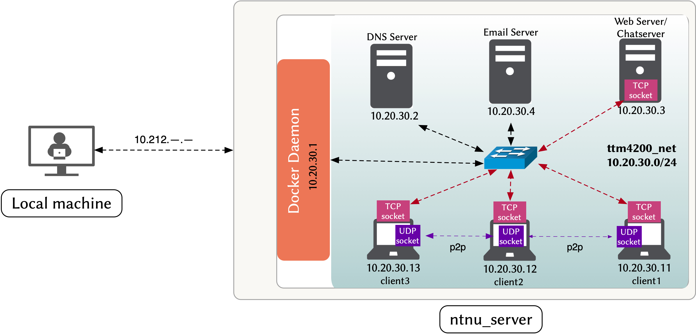
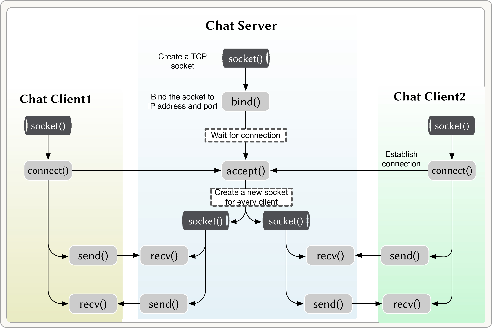
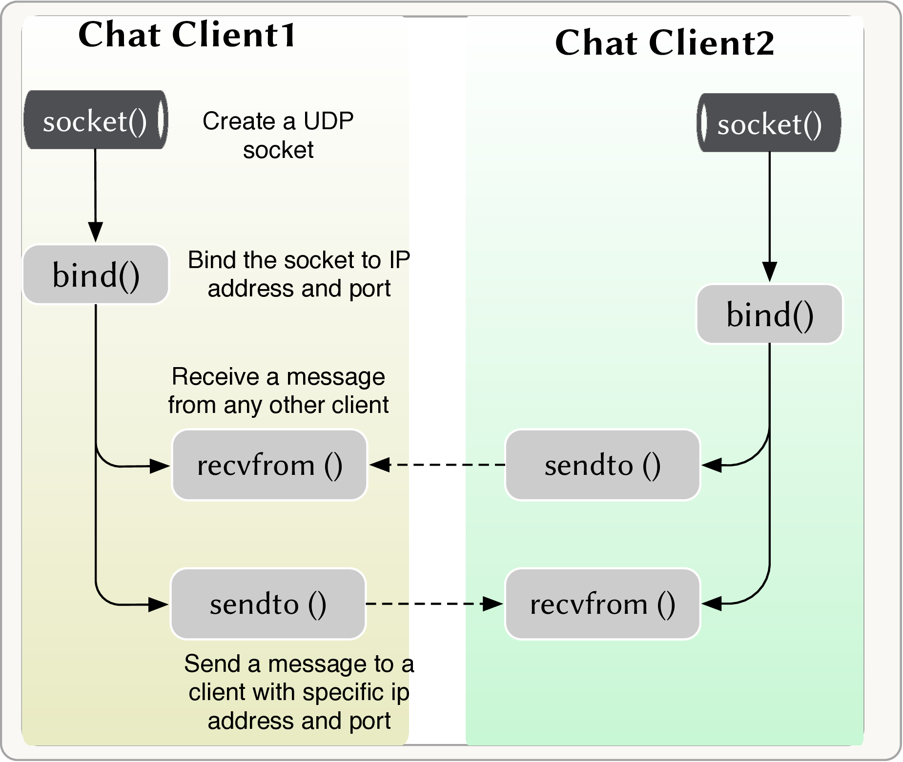

# Lab 3 -- Socket Programming

## Introduction

The goal of this lab is to introduce you to socket programming. 
First, you will write a simple chatroom application that allows multiple users to communicate in a single chatroom using server-client architecture. 
Second, you will modify your application to support peer-to-peer chat. 
Third, you will capture and analyze the network traffic generated by your application. 
Finally, for your **report**, you submit a modified version of your application that supports user authentication.


### Lab setup

In this lab, you will use the same "docker-compose" setup as in the previous lab. 
Refer back to lab2 for instructions on how to setup the environment.

- You will use the DNS server from lab2 to resolve your domain names. **Make sure that the DNS server is running properly before starting this lab, and that you can use the DNS server of your team's domain name in **client1, client2 and client3** containers**.


- [Figure 1](#figure_1) shows the network topology for this lab. You will use the "webserver" container as the server for your chat application. Then, you will use the "client1", "client2" and "client3" containers as clients for your chat application. 


<a id='figure_1'></a>

||
|:--:| 
| *Figure 1: Lab3 setup* |


# Milestone 1 -- Chat Room

In this milestone, you will write a simple chatroom application with the following features:

The server application should:

- Listen for incoming connections on a specified port.

- If a new client connects, the server should:
    - Get the username of the new client and validate it.
    - Broadcast a message to other clients informing them that a new client has joined the chatroom.

- Listen for incoming messages from any connected client and broadcast those messages to the other connected clients.


The client application should:

- Connect to the server application.

- Get the username of the client from the user and send it to the server.

- Listen for incoming messages from the server and display them to the user.

- Listen for user input and send the input to the server.


## Background 

By now, you should be familiar with the basic concepts of socket programming. 
In particular, you **should have read pages 184-195 of the textbook** before starting this lab.
 Additionally, you can refer to the python [Socket Programming HOWTO](https://docs.python.org/3/howto/sockets.html) and [Socket -- Low-level networking interface](https://docs.python.org/3/library/socket.html#module-socket) to get an overview of the python socket API and to get **hints to complete the coding tasks** below. 

Here are some important concepts that are relevant to this lab:

- Before sending text over the network, you need to encode it into bytes. 
Similarly, before displaying text to the user, you need to decode it from bytes. 
You can use the `encode()` and `decode()` methods of the `str` class to do this. 

- Figure 2 shows a simple workflow of a client-server architecture using TCP sockets in python. 
The figure shows the main functions that you need to use to implement the chatroom application. 

<a id='figure_2'></a>

||
|:--:| 
| *Figure 2: Workflow of client-server interaction using TCP sockets.* |

- To handle multiple clients simultaneously, you can create a separate thread for each client. 
In this lab, however, you will use the [`select()`](https://docs.python.org/3/library/select.html) function. 
The `select()` is a form of [Asynchronous I/O](https://en.wikipedia.org/wiki/Asynchronous_I/O), that takes a list of sockets as input and returns a list of sockets that are ready to be read from. 
You can use the `select()` function to check if any of the sockets in the list have received data. 
Additionally, you can use it to check if the user has typed any input. 


## Task 1.1 -- IDE Setup

In this task, you will setup an IDE (Integrated Development Environment) for editing your python code. 
You can use any IDE that you like. 
However, we recommend using [VSCode](https://code.visualstudio.com/) because it is free, open-source and easy to use.

- VSCode is already installed on Sahara's PCs.

- To use VSCode to edit code on your "ntnu_server", you need to install the [Remote-SSH extension](https://marketplace.visualstudio.com/items?itemName=ms-vscode-remote.remote-ssh):
  - On Sahara's PC, open VSCode and click on the "Extensions" icon on the left side of the window.
  - Search for "Remote-SSH" and install the extension.
  - Restart VSCode.

- In VSCode, open the "Command Palette" (Ctrl+Shift+P) and select "Remote-SSH: Connect to Host...". VSCode should detect the "ntnu_server" that you have configured in `~/.ssh/config` (during lab0).

- After connecting to the "ntnu_server", you can open the "labs" folder and start editing your code.

- If you got stuck, check out this [tutorial](https://code.visualstudio.com/docs/remote/ssh) for more information on how to use VSCode for remote development.


## Task 1.2 -- Chat Room Server


You can find the starter code for this task in the file "chatroom_server.py" in the "labs/03-lab3" folder. 
The code is already partially implemented. 
You need to complete the missing parts, indicated by the `=== YOUR CODE HERE ===` comments.

```python
import socket
import select
import sys

# Basic logging configuration
import logging
logging.basicConfig(format='\r[%(levelname)s: line %(lineno)d] %(message)s', level=logging.INFO)
logger = logging.getLogger(__name__)

class ChatRoomServer:

    #__init__ is the constructor of the class
    def __init__(self, ServerIP: str, ServerPort: int, ReceiveBufferSize: int = 2048, MaxClients: int = 10):
        #server address and port
        self.ServerIP = ServerIP
        self.ServerPort = ServerPort
        #maximum amount of data to be received at once
        self.ReceiveBufferSize = ReceiveBufferSize
        # create a TCP socket
        self.server_socket = # === YOUR CODE HERE ===
        # set socket options to reuse the IP address (protocol level is socket, binding to the address is on)
        # === YOUR CODE HERE ===
        # bind the socket to the server address and port
        # === YOUR CODE HERE ===
        # set the maximum number of clients that can connect to the server with listen() function
        # === YOUR CODE HERE ===
        # list of socket descriptors, used as a read list for select()
        self.list_of_sockets = [self.server_socket]
        self.clients = {} # {socket: (name, ip)}

    #broadcast the message to all clients except the source client
    def broadcast(self, message: bytes, source_socket: socket.socket):
        for socket in self.clients.keys():
            #send a message to all the "other" clients
            if socket != source_socket:
                try:
                    # send the message to all the "other" clients
                    # === YOUR CODE HERE ===
                except Exception as err:
                    logger.error("Unable to send message to client. Error message : %s" % err)
                    socket.close()
                    self.remove(socket)

    def remove(self, socket: socket.socket):
        if socket in self.list_of_sockets:
            self.list_of_sockets.remove(socket)
            self.clients.pop(socket)


    def run(self):
        logger.info("Server started on IP: %s, Port: %s" % (self.ServerIP, self.ServerPort))
        while True:
            read_sockets, write_sockets, error_sockets = select.select(self.list_of_sockets, [], [])
            for sock in read_sockets:

                # New connection
                if sock == self.server_socket:
                    # Handle the case in which there is a new connection accepted through server_socket
                    sockfd, addr = # === YOUR CODE HERE ===
                    welcome_message = "Welcome to this chatroom! Type your username and press enter to continue: "
                    welcome_message = welcome_message.encode()

                    # Get the username
                    try:
                        # Send the welcome_message to the client
                        # === YOUR CODE HERE ===
                        # Receive the username from the client
                        username = # === YOUR CODE HERE ===
                        username = username.decode().strip()

                        # check if the username is valid: not empty and not too long, does not contain spaces   
                        if not username or len(username) > 20 or " " in username:
                            invalid_username_message = "Invalid username. Please try again.".encode()
                            # send the invalid username message to the client
                            # === YOUR CODE HERE ===
                            sockfd.close()
                            continue

                        # Check if the username is already taken
                        if any(username == client_details[0] for client_details in self.clients.values()):
                            username_already_taken_message = "Username already taken. Please try again.".encode()
                            # send the username already taken message to the client
                            # === YOUR CODE HERE ===
                            sockfd.close()
                            continue

                        # Username is valid, send a confirmation message
                        confirmation_message = ("Your username (%s) is valid. You can start chatting now." % username).encode()
                        # send the confirmation message to the client
                        # === YOUR CODE HERE ===

                        
                    except Exception as err:
                        logger.error("Unable to get username from client. Error message : %s" % err)
                        sockfd.close()
                        continue

                    # Add new socket descriptor to the list of readable connections
                    self.list_of_sockets.append(sockfd)
                    # Add new client to the list of clients
                    client_details = (username, addr[0])
                    self.clients[sockfd] = client_details
                    # Broadcast new client's details to all other clients
                    broadcast_message = "%s (IP: %s): connected" % client_details
                    print("New client connected: %s" % broadcast_message)
                    broadcast_message = broadcast_message.encode()
                    # broadcast the new client's details to all other clients with broadcast() function
                    # === YOUR CODE HERE ===
                    
                # Some incoming message from a client
                else:
                    # get the client details using the socket object that sent the message
                    client_details = self.clients[sock]
                    # receive data from the socket
                    data = # === YOUR CODE HERE ===

                    # if data is not empty, broadcast it to all other clients
                    if data:
                        broadcast_message = "%s (IP: %s) says: %s" % (client_details[0], client_details[1], data.decode())
                        print("Broadcast message from client: %s" % broadcast_message)
                        broadcast_message = broadcast_message.encode()
                        # broadcast the message to all other clients with broadcast() function
                        # === YOUR CODE HERE ===

                    # if data is empty, the client closed the connection
                    else:
                        broadcast_message = "%s (IP: %s): is offline" % client_details
                        print ("Client disconnected: %s" % broadcast_message)
                        broadcast_message = broadcast_message.encode()
                        # broadcast the client's disconnection to all other clients with broadcast() function
                        # === YOUR CODE HERE ===
                        sock.close()
                        self.remove(sock)

        self.server_socket.close()


if __name__ == "__main__":
    # Get the server IP address using hostname (DO NOT WRITE THE IP ADDRESS DIRECTLY)
    ServerIP = # === YOUR CODE HERE ===
    # Select a port number that the server will listen on (should be > 1024)
    ServerPort = # === YOUR CODE HERE ===
    ReceiveBufferSize = 2048
    MaxClients = 10
    # Create a new ChatRoomServer object using the above parameters
    server = # === YOUR CODE HERE ===
    # run the server
    # === YOUR CODE HERE ===

```


## Task 1.3 -- Chat Room Client


You can find the starter code for this task in the file "chatroom_client.py" in the "labs/03-lab3" folder. 
The code is already partially implemented. 
You need to complete the missing parts, indicated by the `=== YOUR CODE HERE ===` comments.

```python
import socket
import select
import sys

# Basic logging configuration
import logging
logging.basicConfig(format='\r[%(levelname)s: line %(lineno)d] %(message)s', level=logging.INFO)
logger = logging.getLogger(__name__)


class ChatRoomClient:

    def __init__(self, ServerIP: str, ServerPort: int, ReceiveBufferSize: int = 2048):
        #server address and port
        self.ServerIP = ServerIP
        self.ServerPort = ServerPort
        self.ReceiveBufferSize = ReceiveBufferSize
        # Create a TCP socket
        self.client_socket = # === YOUR CODE HERE === 
        self.client_socket.settimeout(2)
        self.list_of_sockets = [sys.stdin, self.client_socket]
        # Connect to remote server
        try:
            # connect to the server
            # === YOUR CODE HERE ===
        except Exception as err:
            logger.error("Unable to connect to the server. Error message : %s " % err)
            sys.exit()
        logger.info("Connected to the chat server. IP: %s, Port: %s.\n To exit the chatroom type ':q'" % (self.ServerIP, self.ServerPort))

    def run(self):
        while True:
            read_sockets, write_sockets, error_sockets = select.select(self.list_of_sockets, [], [])
            for sock in read_sockets:

                # Incoming message from remote server
                if sock == self.client_socket:
                    # receive data from the server
                    data = # === YOUR CODE HERE ===
                    # empty string means the server has closed the connection
                    if not data:
                        logger.info("Disconnected from chat server")
                        sys.exit()
                    else:
                        print ("\r[Server] " + data.decode())
                        print ("\r[Me]", end = " ", flush = True)
                
                # User entered a message
                else:
                    msg = sys.stdin.readline()
                    msg = msg.strip()
                    
                    # check if empty message
                    if not msg:
                        print ("\r[Me]", end = " ", flush = True)
                        continue
                    # check if the user wants to exit 
                    elif msg == ":q":
                        self.client_socket.close()
                        sys.exit()
                    # try to send the message
                    else:
                        try:
                            msg = msg.encode()
                            # send the message to the server
                            # === YOUR CODE HERE ===
                        except Exception as err:
                            logger.error("Unable to send message to the server. Error message : %s " % err)
                            sys.exit() 
                    print ("\r[Me]", end = " ", flush = True)


if __name__ == "__main__":
    # Get the server IP address using domain name of your team (e.g., team30.com): DO NOT WRITE THE IP ADDRESS DIRECTLY
    ServerIP = # === YOUR CODE HERE ===
    # write the port number that the server is listening on.
    ServerPort = # === YOUR CODE HERE === 
    MaxReceiveBufferSize = 2048
    # Create a ChatRoomClient object using the above parameters
    client = # === YOUR CODE HERE ===
    # run the client
    # === YOUR CODE HERE ===
```


- After completing the above code, copy the file "chatroom_server.py" to the "webserver" container:

```bash
scp chatroom_server.py 10.20.30.3:~/chatroom_server.py
```


- Copy the file "chatroom_client.py" to "client1", "client2", and "client3" containers:

```bash
for x in {11,12,13}; do scp chatroom_client.py 10.20.30.$x:~/chatroom_client.py; done
```


- Run the python files in their respective containers:

```bash

python3 ===FILE_NAME===
```


- Verify that the chatroom works as expected. 


**SHOW YOUR TA THAT YOUR CHATROOM APPLICATION WORKS**


# Milestone 2 -- Peer-to-Peer Chat

Modify the chatroom application to support peer-to-peer communication. 

In addition to the features of the application in Milestone 1, the peer-to-peer chat application should also:

The server: 

- Keep track of the clients that are connected to the server.

- Send the list of connected clients to each client when:
  - A new client connects to the server.
  - A client disconnects from the server.

The client:

- Receive the list of connected clients from the server and update the list of peers.

- Send a message to a specific peer using a UDP socket.


## Background


- Figure 3 shows a simple workflow of peer-to-peer communication using UDP sockets.

<a id='figure_2'></a>

||
|:--:| 
| *Figure 2: Workflow of peer-to-peer communication using UDP sockets* |


- When sending a list (of clients), we need to serialize the list into a string. 
We can use the `json` module to do that. 
For example: `json.dumps(list_of_clients)` will serialize the list of clients into a string. 
On the client side, we can use `json.loads(data)` to deserialize the string into a list.

- When the server sends consecutive messages to the client, the client might receive them as a single message. 
For example, when the server sends the welcome message and the list of clients, the client might receive them as a single message. 
For simplicity, we use a delay of 0.5 seconds `time.sleep(0.5)` to make sure that the client receives the messages separately. 
Feel free to explore other solutions, such as:
  - Use a line-oriented protocol (each message is terminated by a newline character).
  - Use a length-prefixed message format (each message starts with a length field, followed by the message data).
  - Use a fixed-length message format (each message has a fixed length, by padding the message with spaces if needed).


## Task 2.1 --  Chat Server

You can find the starter code for this task in the file "chatroom_p2p_server.py" in the "labs/03-lab3" folder. 
The code is already partially implemented. 
You need to complete the missing parts, indicated by the `=== YOUR CODE HERE ===` comments.

```python
import socket
import select
import sys
import json
import time

# Basic logging configuration
import logging
logging.basicConfig(format='\r[%(levelname)s: line %(lineno)d] %(message)s', level=logging.INFO)
logger = logging.getLogger(__name__)


class ChatRoomP2PServer:

    def __init__(self, ServerIP: str, ServerPort: int, ReceiveBufferSize: int = 2048, MaxClients: int = 10):
        self.ServerIP = ServerIP
        self.ServerPort = ServerPort
        self.ReceiveBufferSize = ReceiveBufferSize
        # create a TCP socket
        self.server_socket = # === YOUR CODE HERE ===
        # set socket options to reuse the IP address (protocol level is socket, binding to the address is on) 
        # === YOUR CODE HERE ===
        # bind the socket to the server address and port
        # === YOUR CODE HERE ===
        # set the maximum number of accepted connections to the server with listen() function
        # === YOUR CODE HERE ===
        # list of socket descriptors, used as a read list for select()
        self.list_of_sockets = [self.server_socket]
        self.clients = {} # {socket: (name, ip)}

    def broadcast(self, message: bytes, source_socket: socket.socket):
        for socket in self.clients.keys():
            if socket != source_socket:
                try:
                    # send the message to the client
                    # === YOUR CODE HERE ===
                except Exception as err:
                    logger.error("Unable to send message to client. Error message : %s" % err)
                    socket.close()
                    self.remove(socket)

    def remove(self, socket: socket.socket):
        if socket in self.list_of_sockets:
            self.list_of_sockets.remove(socket)
            self.clients.pop(socket)

    # function to broadcast list of clients to all connected clients
    def broadcast_list_of_clients(self):
        # create a list of clients
        list_of_clients = list(self.clients.values())
        # convert the list of clients to json string
        list_of_clients = json.dumps(list_of_clients) 
        #sleep for 0.5 seconds to make sure the client has received the welcome message. This is to avoid concatenating the welcome message with the list of clients.
        time.sleep(0.5)
        # broadcast the encoded list of clients to all connected clients
        # the source_socket is the server_socket: the server is sending the list
        # use broadcast() function
        # === YOUR CODE HERE ===


    def run(self):
        logger.info("Server started on IP: %s, Port: %s" % (self.ServerIP, self.ServerPort))
        while True:
            read_sockets, write_sockets, error_sockets = select.select(self.list_of_sockets, [], [])
            for sock in read_sockets:

                # New connection
                if sock == self.server_socket:
                    # Handle the case in which there is a new connection accepted through server_socket
                    sockfd, addr = # === YOUR CODE HERE ===
                    welcome_message = "Welcome to this chatroom! Type your username and press enter to continue: "
                    welcome_message = welcome_message.encode()

                    # Get the username
                    try:
                        # send the welcome message to the client
                        # === YOUR CODE HERE ===
                        # receive the username from the client
                        username = # === YOUR CODE HERE ===
                        username = username.decode().strip()

                        # check if the username is valid: not empty and not too long, does not contain spaces   
                        if not username or len(username) > 20 or " " in username:
                            invalid_username_message = "Invalid username. Please try again. ".encode()
                            # send the invalid username message to the client
                            # === YOUR CODE HERE ===
                            sockfd.close()
                            continue

                        # Check if the username is already taken
                        if any(username == client_details[0] for client_details in self.clients.values()):
                            username_already_taken_message = "Username already taken. Please try again.".encode()
                            # send the username already taken message to the client
                            # === YOUR CODE HERE ===
                            sockfd.close()
                            continue

                        # Username is valid, send a confirmation message
                        confirmation_message = ("Your username (%s) is valid. You can start chatting now." % username).encode()
                        # send the confirmation message to the client
                        # === YOUR CODE HERE ===
                        
                    except Exception as err:
                        logger.error("Unable to get username from client. Error message : %s" % err)
                        sockfd.close()
                        continue

                    # Add new socket descriptor to the list of readable connections
                    self.list_of_sockets.append(sockfd)
                    # Add new client to the list of clients
                    client_details = (username, addr[0])
                    self.clients[sockfd] = client_details
                    # Broadcast new client's details to all other clients
                    broadcast_message = "%s (IP: %s) connected" % client_details
                    print("New client connected: %s" % broadcast_message)
                    broadcast_message = broadcast_message.encode()
                    # broadcast the message to all clients except the new client with broadcast() function
                    # === YOUR CODE HERE ===
                    # broadcast updated list of clients to all clients with broadcast_list_of_clients() function
                    # === YOUR CODE HERE ===
                    
                # Some incoming message from a client
                else:
                    # get the client details using the socket object that sent the message
                    client_details = self.clients[sock]
                    # receive data from the socket
                    data = # === YOUR CODE HERE ===

                    # if data is not empty, broadcast it to all other clients
                    if data:
                        broadcast_message = "%s (IP: %s) said: %s" % (client_details[0], client_details[1], data.decode())
                        print ("Broadcasting message from client: %s" % broadcast_message)
                        broadcast_message = broadcast_message.encode()
                        # broadcast the message to all clients except the client that sent the message
                        # === YOUR CODE HERE ===

                    # if data is empty, the client closed the connection
                    else:
                        broadcast_message = "%s (IP: %s) is offline" % client_details
                        print ("Client disconnected: %s" % broadcast_message)
                        broadcast_message = broadcast_message.encode()
                        # broadcast the message to all clients
                        # === YOUR CODE HERE ===
                        sock.close()
                        self.remove(sock)
                        # update the list of clients to all clients with the broadcast_list_of_clients() function
                        # === YOUR CODE HERE ===

        self.server_socket.close()


if __name__ == "__main__":
    # Get the server IP address
    ServerIP = # === YOUR CODE HERE ===
    ServerPort = # === YOUR CODE HERE ===
    ReceiveBufferSize = 2048
    MaxClients = 10
    server = # === YOUR CODE HERE ===
    # run the server
    # === YOUR CODE HERE ===

```


## Task 2.2 --  Chat Client


You can find the starter code for this task in the file "chatroom_p2p_client.py" in the "labs/03-lab3" folder. 
The code is already partially implemented. 
You need to complete the missing parts, indicated by the `=== YOUR CODE HERE ===` comments.

```python
import socket
import select
import sys
import json

# Basic logging configuration
import logging
logging.basicConfig(format='\r[%(levelname)s: line %(lineno)d] %(message)s', level=logging.INFO)
logger = logging.getLogger(__name__)


class ChatRoomP2PClient:

    def __init__(self, ServerIP: str, ServerPort: int, ClientIP: str, P2PPort: int, ReceiveBufferSize: int = 2048):
        self.ServerIP = ServerIP
        self.ServerPort = ServerPort
        self.ClientIP = ClientIP
        self.P2PPort = P2PPort
        self.ReceiveBufferSize = ReceiveBufferSize
        # Create TCP and UDP sockets
        self.client_socket_TCP= # === YOUR CODE HERE ===
        self.client_socket_TCP.settimeout(2)
        self.client_socket_UDP = # === YOUR CODE HERE ===
        self.client_socket_UDP.settimeout(2)
        # bind the UDP socket to the client's IP and P2P port
        # === YOUR CODE HERE ===
        # set the UDP socket to reuse the address
        # === YOUR CODE HERE ===
        self.list_of_sockets = [sys.stdin, self.client_socket_TCP, self.client_socket_UDP]
        self.p2p_peers = {} # {name: ip}
    
        # Connect to the chat server using the TCP socket
        try:
            # === YOUR CODE HERE ===
        except Exception as err:
            logger.error("Unable to connect to the server. Error message : %s" % err)
            sys.exit()

        logger.info("Connected to the chat server. IP: %s, Port: %s.\n To exit the chatroom type ':q'\n To list all online users type ':l'\n To send a p2p message type '@username: message' " % (self.ServerIP, self.ServerPort))

    # function to change the list of peers received from the server to the dictionary
    def update_peers(self, peers):
        self.p2p_peers = {peer[0]: peer[1] for peer in peers}


    def run(self):
        while True:
            read_sockets, write_sockets, error_sockets = select.select(self.list_of_sockets, [], [])
            for sock in read_sockets:

                # Incoming message from remote server
                if sock == self.client_socket_TCP:
                    # Receive data from the server
                    data = # === YOUR CODE HERE ===
                    # empty string means the server has closed the connection
                    if not data:
                        logger.info("Disconnected from chat server")
                        sys.exit()
                    else:
                        data = data.decode()
                        # check if the data is json
                        data = data.strip()
                        if data[0] == '[':
                            data = json.loads(data)
                            # update the list of peers using the update_peers() function
                            # === YOUR CODE HERE ===

                        else:
                            print("\r[Server] " + data )
                            print ("\r[Me]", end = " ", flush = True)

                # Incoming message from UDP socket
                elif sock == self.client_socket_UDP:
                    # Receive data from a peer (p2p)
                    data, addr = # === YOUR CODE HERE ===
                    data = data.decode()
                    peer_IP_address = addr[0]
                    peer_username = [username for username, ip in self.p2p_peers.items() if ip == peer_IP_address][0]
                    print ("\r[P2P] %s (IP: %s) says: %s" % (peer_username, peer_IP_address, data))
                    print ("\r[Me]", end = " ", flush = True)

                # User entered a message
                else:
                    msg = sys.stdin.readline()
                    msg = msg.strip()
                    # check if empty message
                    if not msg:
                        print ("\r[Me]", end = " ", flush = True)
                        continue
                    # check if the user wants to exit
                    elif msg == ':q':
                        self.client_socket_TCP.close()
                        sys.exit()
                    elif msg == ':l':
                        peers = list(self.p2p_peers.keys())
                        print ("\rOnline peers: %s" % peers)
                    # check if the user wants to send a p2p message
                    elif msg[0] == '@':
                        username = msg[1:msg.find(':')]
                        msg = msg[msg.find(':')+1:]
                        if username in self.p2p_peers.keys():
                            peer_IP_address = self.p2p_peers[username]
                            try:
                                # send the message to the peer (p2p)
                                # === YOUR CODE HERE ===
                            except Exception as err:
                                logger.error("Unable to send p2p message to %s. Error message : %s" % (username, err))
                        else:
                            print ("\rUser (%s) not found" % username)

                    # broadcast message to all connected clients (through the server) 
                    else:
                        try:
                            msg = msg.encode()
                            # send the message to the server
                            # === YOUR CODE HERE ===
                        except Exception as err:
                            logger.error("Unable to send message to the server. Error message : %s" % err)
                            sys.exit()

                    print("\r[Me]", end = " ", flush = True)


if __name__ == "__main__":
    # get the server IP address (DO NOT WRITE THE IP ADDRESS DIRECTLY IN THE CODE)
    ServerIP = # === YOUR CODE HERE ===
    ServerPort = # === YOUR CODE HERE ===
    MaxReceiveBufferSize = 2048
    # get the client IP address (DO NOT WRITE THE IP ADDRESS DIRECTLY IN THE CODE)
    ClientIP = # === YOUR CODE HERE ===
    # set the client's P2P port
    P2PPort = # === YOUR CODE HERE ===
    client = # === YOUR CODE HERE ===
    # run the client
    # === YOUR CODE HERE ===
```


- After completing your code, copy the files and run them inside the respective containers.

- Verify that your code works as expected.


**SHOW YOUR TA THAT YOUR APPLICATION WORKS AS EXPECTED**


# Milestone 3 -- Capturing and Analyzing Network Traffic

## Task 3.1 -- Traffic Capture
 


* Start a packet capture with `tcpdump` on your chat server and dumpt the capture to a "chatserver.pcap" file, then start your "chatroom_p2p_server.py" code.

* Start packet capturing on the two clients and dump the capture to files named "client1.pcap" and "client2.pcap", then start your "chatroom_p2p_client.py" code.


* Send messages to the chatroom and to other clients (p2p messages). 
Then stop the packet capture on the server and the clients.

* Copy the capture files to your "ntnu_server" in the "03-lab3" folder.

## Task 3.2 -- Analyzing TCP Traffic


* Open your "chatserver.pcap" in Wireshark and display only TCP packets from "client1" and "client2": `(ip.addr == 10.20.30.11 || ip.addr == 10.20.30.12) && tcp`.

* Disable the display of relative sequence numbers in wireshark: **Edit**$\rightarrow$**Preferences**$\rightarrow$ expand **Protocols** $\rightarrow$ **TCP** $\rightarrow$ untick the box for  **Relative sequence numbers**

>_By default, Wireshark keeps track of all TCP sessions and converts all Sequence Numbers, and Acknowledge Numbers into relative numbers. 
This means that instead of displaying the real/absolute numbers, Wireshark will display numbers relative to the first seen segment for that conversation._

* Navigate to **Statistics** $\rightarrow$ **Flow Graph**. 
Tick the box of **Limit to display filter**, then select **TCP Flows** from **Flow type**. 
This will display a sequence diagram of the TCP packets exchanged between the clients and the server. 
It will also display the sequence and Acknowledgement numbers on the right-hand side.

* Answer the following questions:
  - What is the sequence number of the TCP SYN segment used to initiate the first TCP connection between "client1" and the server? 
  - What is the sequence number of SYNACK segment sent by the server to the client in reply to the SYN?
  - What is the value of the ACKnowledgement field in the SYNACK segment?


```python
from test_lab3 import TestLab3
check_progress = TestLab3()
```


```python
# What is the sequence number of the TCP SYN segment used to initiate the first TCP connection between "client1" and the server? 
SYN_sequence_number =  #your answer (as an integer)

# What is the sequence number of SYNACK segment sent by the server to the client in reply to the SYN?
SYNACK_sequence_number =  #your answer (as an integer)

# What is the value of the ACKnowledgement field in the SYNACK segment?
SYNACK_ACKnowledgement_number =  #your answer (as an integer)
check_progress.test_3_2(SYN_sequence_number, SYNACK_sequence_number, SYNACK_ACKnowledgement_number)

```

## Task 3.3 -- Analyzing UDP Traffic

* Open "client1.pcap" file in Wireshark and display only UDP packets from and to the other client (`ip.addr == 10.20.30.12 && udp`).
Then answer the following questions:
  - Select one UDP packet from your trace (corresponding to a chat message). 
  From this packet, determine how many fields are in the UDP header.
  - What is the length (in bytes) of a UDP header field?
  - What is the maximum number of bytes that can be included in a UDP payload?
  - What is the largest possible source port number?
  - What is the protocol number for UDP?


```python

# How many fields are in the UDP header?
number_of_fields_in_UDP_header =  #your answer (as an integer) 

# What is the length (in bytes) of a UDP header field?
length_of_header_field =  #your answer (as an integer) 

# What is the maximum number of bytes that can be included in a UDP payload?
maximum_number_of_bytes_in_UDP_payload =  #your answer (as an integer) 

# What is the largest possible source port number?
largest_possible_source_port_number =  #your answer (as an integer) 

# What is the protocol number for UDP?
protocol_number_for_UDP =  #your answer (as an integer) 

check_progress.test_3_3(number_of_fields_in_UDP_header, 
                        length_of_header_field, 
                        maximum_number_of_bytes_in_UDP_payload, 
                        largest_possible_source_port_number, 
                        protocol_number_for_UDP)


```

# Milestone 4 -- Delivery

__Delivery Q1:__ Modify the server and client programs from Milestone 2 to also support user authentication. 
Your application should support the following **additional** features:

The server application should:

- Maintain a list of usernames and passwords.

- When a client connects to the server, the server should prompt the client for either login or register.

- If the client selects login, the server should:
  - Prompt the client for a username and password.
  - If the username and password are valid, the server should send the list of connected clients to the client.
  - If the username and password are invalid, the server should close the connection.

- If the client selects register, the server should:
  - Prompt the client for a username and password.
  - If the username is not already in use, the server should add the username and password to the list of usernames and passwords and send the list of connected clients to the client.
  - If the username is already in use, the server should close the connection.

- The server should store the passwords in a hashed format (not in plain text). You can use the [`hashlib`](https://docs.python.org/3/library/hashlib.html) module to hash the passwords ([Hint](https://stackoverflow.com/a/56915300/893857)).

The client application should:

- Prompt the user for either login or register.

- If the user selects login, the client should:
  - Prompt the user for a username and password.
  - Send the username and password to the server.
  - If the username and password are valid, the client should display the list of connected clients.
  - If the username and password are invalid, the client should display an error message and exit.

- If the user selects register, the client should:
  - Prompt the user for a username and password.
  - Send the username and password to the server.
  - If the username is not already in use, the client should display the list of connected clients.
  - If the username is already in use, the client should display an error message and exit.

- Finally, as you prepare to test your application, you can take into account if the following actions are according to the requirements:
  - Registration and authentication of client1. 
  - Registration and authenticaton of client2. 
  - Registration and authentication of client3.
  - Correct storing of usernames and password. 
  - Communication with the server and P2P communication between two clients.
  - Behaviour of the application when the username is already in use. 
  - Login of a client after being "offline". 

__Note__: These steps should only __assist__ you in the testing process to verify if your application works as expected. 


__Delivery Q2:__ Write a report (in fewer than two pages, including the sequence diagram) explaining the flow of the chat application you have built in __Delivery Q1__. 
Your report should at least address the following points:

* How hostnames and addresses get resolved.

* How TCP and UDP sockets are created (protocol family, type of service) and associated with addresses.

* How a server socket handles multiple incoming connections. 

* Highlight the difference between connection-oriented and connectionless.

* Based on your application, draw a sequence diagram of __all packet transactions__ between the clients and the server (one diagram only) when a new client connects and sends one direct message. 
__Hint__: Look at the task 3.2.

* If your code in __Delivery Q1__ is not working, explain why it is not working and how you have tried to fix it.

**Your explanation should be specific to your application.** 
Do not write a generic explanation from the textbook, Internet, or ChatGPT.

   
**Submit a PDF report along with the Python files**.


## Optional -- GitHub Copilot

If you are interested, you can try out GitHub [Copilot](https://copilot.github.com/) to help you write your code faster. Copilot is an AI-powered code completion tool that suggests code snippets based on your context. See this [tutorial](https://docs.github.com/en/copilot/getting-started-with-github-copilot/getting-started-with-github-copilot-in-visual-studio-code) to learn how to integrate Copilot with VS Code.
